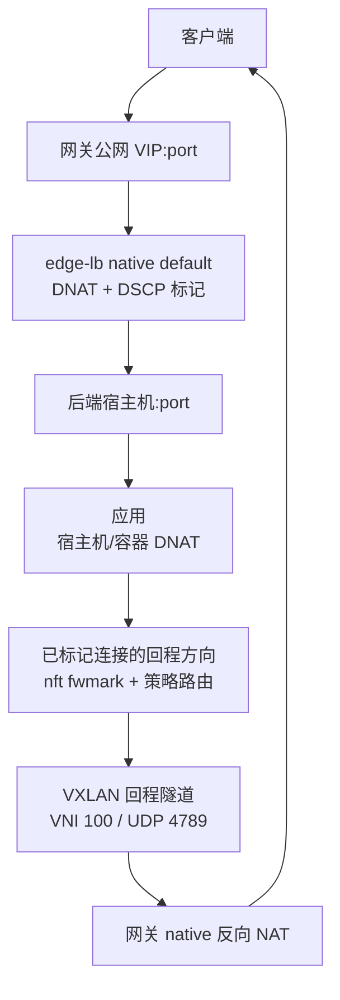

# Edge LB

[English](README.md) | **简体中文**

云 VPC 环境下的四层负载均衡 agent。edge-lb 使用内置 native DNAT/SNAT 数据面，
同时保留后端看到的**真实客户端 IP**。

## 解决什么问题

云 VPC 只转发目的 MAC/IP 属于本机的流量。网关做 default DNAT 并保留客户端
源 IP 后，后端回包的目的地址仍是公网客户端，不能在 VPC 内自然回到网关，
非对称路由会导致连接失败。若改用 SNAT 类模式，又会丢失真实客户端 IP。

Edge LB 的方案：



只有经过网关标记的连接才走 VXLAN 回程；直连后端公网的流量完全不受影响。

## 快速开始

在 x86_64 Linux 上（或在任意主机上使用 `Makefile` 里的 Docker 构建）：

```bash
make ebpf release      # eBPF 对象 + x86_64 release 二进制
make ui                # 可选：构建管理面板（bun + rolldown-vite）
BIN=target/x86_64-unknown-linux-gnu/release/edge-lb

# 后端节点（先）
sudo $BIN install backend
# 网关节点（后）
sudo $BIN install gateway

edge-lb verify         # 两条路径 + eBPF 计数验证
```

打包入口包括 `scripts/package.sh`、`scripts/deb.sh` 和
`deploy/container.Dockerfile`。

## Debian 包安装

先安装对应角色的 Debian 包，再写入 systemd service 配置并启动 daemon：

```bash
sudo dpkg -i edge-lb-gateway_<version>_<arch>.deb
sudo edge-lb install service --role gateway
sudo systemctl enable edge-lb
sudo systemctl start edge-lb
sudo journalctl -u edge-lb.service -f
```

backend 节点使用 backend 包和 backend 角色：

```bash
sudo dpkg -i edge-lb-backend_<version>_<arch>.deb
sudo edge-lb install service --role backend
sudo systemctl enable edge-lb
sudo systemctl start edge-lb
sudo journalctl -u edge-lb.service -f
```

## 命令

```bash
edge-lb --config /etc/edge-lb/config.toml # 按配置中的 node_role 运行
edge-lb ui serve                         # 管理 API/UI（默认 127.0.0.1:18080；
                                         # gateway daemon 也会自动带起）
edge-lb verify                           # VIP 路径 + 直连路径 + eBPF 计数
edge-lb config validate|init             # 配置校验 / 生成带注释的角色化模板
edge-lb install [gateway|backend]        # 安装 systemd 服务
edge-lb uninstall service                # 卸载 systemd 服务
```

所有默认参数支持 CLI 覆盖（`--help` 查看全部）。

## 配置

`/etc/edge-lb/config.toml`，按角色分节。部署模板按 gateway/backend 分开，
把本机身份放在顶层，
gateway 专属的控制面/API 配置放到 `[gateway.*]`，backend 专属的订阅和
回程配置放到 `[backend.*]`：

```toml
node_role = "gateway"        # gateway | backend
[discovery]                  # 本机 IP / 出口网卡自动发现
[gateway.ha]                 # gateway 主备
[gateway.xds]                # xDS-like 控制面监听
[gateway.network]            # overlay/VXLAN/DSCP 参数源
[gateway.api]                # 管理 UI/API
[gateway.metrics]            # gateway-only Prometheus metrics
[backend.xds]                # backend 订阅 gateway xDS
[backend.return_path]        # backend nft/route 回程配置
```

架构说明见 **[docs/architecture.md](docs/architecture.md)**；完整配置指南见
**[docs/config.md](docs/config.md)**，部署模板按角色拆分为
`deploy/config.gateway.example.toml` 和 `deploy/config.backend.example.toml`。
监听配置通过 gateway UI/API 管理并持久化到 `state_dir`，不写入 TOML。

## 管理 UI / API

`edge-lb ui serve`（或 gateway daemon 自带）：节点状态、监听配置、目标组、
自动目标组、通知、主备切换、apply 和 cleanup；危险操作先展示变更摘要。

gateway 角色的独立 `ui serve` 也会发送待同步的 HA 配置，但不启动 BFD 或数据面。
该进程必须独占 `state_dir`，不要与使用同一数据库的 gateway daemon 同时运行。

```text
GET     /api/v1/status
GET     /api/v1/nodes/gateways
GET     /api/v1/nodes/backends          （运行时 xDS 注册）
GET/POST/PUT/DELETE /api/v1/listener-configs[/{name}]
GET/POST/PUT/DELETE /api/v1/target-groups[/{name}]
GET/POST/PUT/DELETE /api/v1/automations[/{name}]
GET/POST /api/v1/notifications
GET/DELETE /api/v1/notifications/{id}
POST    /api/v1/notifications/{id}/test
GET/PUT /api/v1/ha/config
GET     /api/v1/ha/status
POST    /api/v1/ha/failover
POST    /api/v1/operations/{apply|cleanup}
```

默认只监听 `127.0.0.1:18080`；监听非 loopback 必须配置 `gateway.api.auth_token`
（Bearer），否则拒绝启动。API 来源还要匹配 `gateway.api.trusted_source_cidrs`；
空数组表示自动信任本机 underlay IP 所在网段。

gateway 可选开启独立 metrics 端口：

```toml
[gateway.metrics]
enabled = true
listen = "0.0.0.0:19090"
trusted_source_cidrs = ["192.168.0.0/24"]
```

metrics 只提供 `GET /metrics`，不属于 `/api/v1`，只使用 CIDR 白名单。
完整指标清单见 **[docs/metrics.md](docs/metrics.md)**。

## 性能测试摘要

2026-09-11 高并发实验使用 VIP `192.168.0.6:8080`，文档中已省略公网地址。
完整报告见
**[docs/high-concurrency-test-report-2026-09-11.md](docs/high-concurrency-test-report-2026-09-11.md)**。

| 角色 | 主机 | 实验地址 | 运行状态 | CPU / 内存 | CPU 频率采样 |
| --- | --- | --- | --- | --- | --- |
| gateway-a | VM-0-12-ubuntu | `192.168.0.12` | `edge-lb 0.1.8`, active | 2 vCPU AMD EPYC 7K62, 3.6 GiB | 2595.1 MHz |
| gateway-b | VM-0-16-ubuntu | `192.168.0.16` | `edge-lb 0.1.8`, active | 2 vCPU AMD EPYC 7K62, 3.6 GiB | 2595.1 MHz |
| backend-a | VM-0-14-ubuntu | `192.168.0.14` | `edge-lb 0.1.8`, active | 1 vCPU AMD EPYC 7K62, 0.9 GiB | 2595.1 MHz |
| backend-b | VM-0-13-ubuntu | `192.168.0.13` | `edge-lb 0.1.8`, active | 2 vCPU General Processors, 1.9 GiB | 2595.1 MHz |
| client | VM-0-10-ubuntu | `192.168.0.10` | `ha-bench` | 2 vCPU General Processors, 1.9 GiB | 2595.1 MHz |

| 场景 | TCP 成功 CPS | TCP 成功率 | UDP 请求吞吐 | UDP 成功率 |
| --- | ---: | ---: | ---: | ---: |
| `concurrency=16`, `timeout=1000ms` | 8734.2 | 100.00% | 19502.2 req/s | 100.00% |
| `concurrency=64`, `timeout=1000ms` | 8906.9 | 99.98% | 31204.1 req/s | 99.97% |
| `concurrency=64`, `timeout=3000ms` | 8928.1 | 100.00% | 30856.4 req/s | 99.99% |
| `concurrency=64`, `timeout=5000ms` | 8839.3 | 100.00% | 31658.8 req/s | 99.99% |
| `consistent_hash`, `concurrency=64`, `timeout=5000ms` | 8524.1 | 100.00% | 31377.7 req/s | 100.00% |
| `consistent_hash` UDP 源端口样本，`concurrency=64`, `timeout=5000ms` | - | - | 59846.6 req/s | 100.00% |

TCP 测试模式为 `new-per-request`，因此本轮 TCP RPS 可视为 CPS。UDP 使用 worker
socket 复用，没有连接建立过程，所以按请求吞吐统计。随着客户端 timeout 拉长，
timeout 数明显下降。2026-09-15 的 `consistent_hash` 回归在 `concurrency=64`、
5 秒 timeout 下 TCP/UDP 均为 0 失败；active gateway 未记录 target miss、
return miss 或 checksum error。

`consistent_hash` UDP 分布复测：

| UDP 模式 | total | ok | fail | RPS | 去重源端口 | 后端分布 |
| --- | ---: | ---: | ---: | ---: | ---: | --- |
| `reuse-per-worker` | 1882660 | 1882660 | 0 | 31377.7 | 约 64 | `81.4% / 18.6%` |
| `new-per-request` | 3590796 | 3590793 | 3 | 59846.6 | 55536 | `48.7% / 51.3%` |

## 仓库结构

```text
edge-lb/          用户态 agent（CLI / daemon / HTTP API / systemd 安装）
edge-lb-ebpf/     DSCP marker 和 native 数据面 eBPF（Rust + Aya）
edge-lb-common/   共享类型
ui/               Vue 3 + TypeScript + rolldown-vite 管理面板（bun）
deploy/           systemd unit、部署/安装脚本、示例配置
docs/             当前架构、配置、API 和验证文档
```

## 构建说明

- 用户态 crate 依赖 aya，需在 Linux 环境编译：`make check / clippy / test`
  已包装为 Docker 容器执行（Apple Silicon 上可用）。
- eBPF 对象需 `nightly-2025-12-01` 和 `bpf-linker` v0.11.0：
  使用预编译 `bpf-linker` release 后执行 `make ebpf`。
- 前端使用 bun：`make ui`。
- tar 包：`make package`；按角色区分的 Debian 包：
  `make deb` 会生成 `edge-lb-gateway_<version>_<arch>.deb` 和
  `edge-lb-backend_<version>_<arch>.deb`；本地容器镜像：
  `make container-image`。多平台镜像推送：
  `make container-image-push`。

## 注意事项

- 主备为 Active/Standby：切换只保证新连接恢复，已有连接中断；公网入口
  （EIP 绑定）迁移不在 agent 职责内。
- native 数据面当前优先覆盖 IPv4 TCP/UDP default DNAT。其他 NAT/proxy
  模式不属于第一版工作范围。
