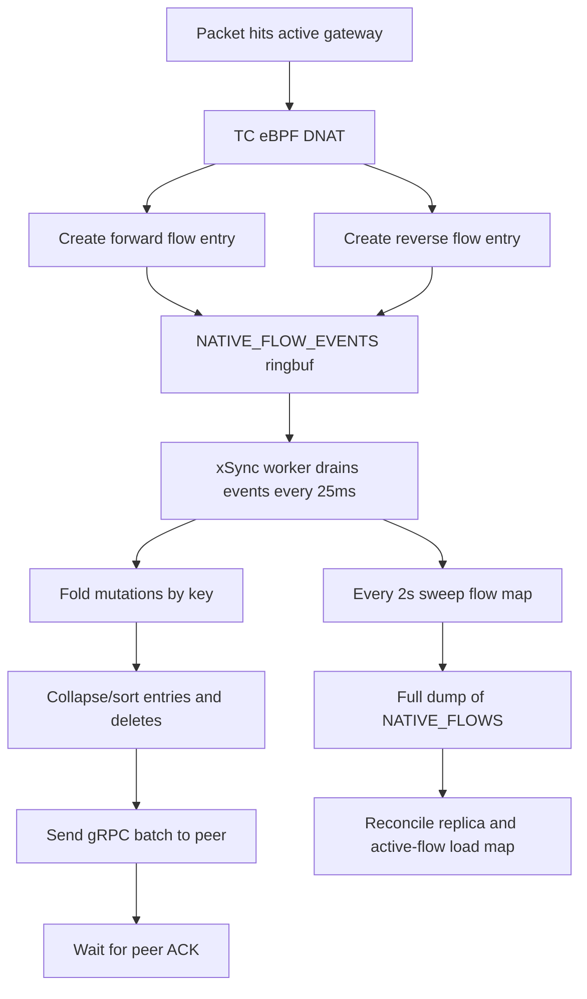
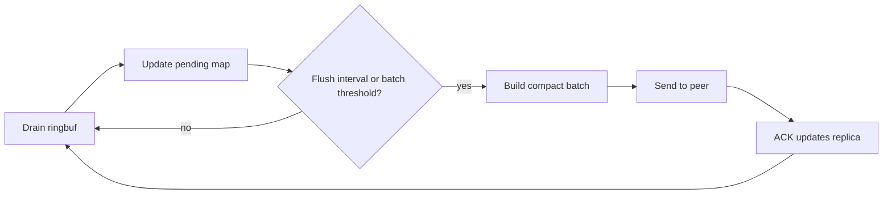

# Active Gateway Pressure Optimization Plan

## Background

The latest Redirect-only validation shows that backend return traffic is already
handled by TC eBPF. Backend `edge-lb` process CPU stays close to zero during the
high-concurrency UDP test, while the active gateway `edge-lb` process becomes the
visible pressure point under high flow churn.

The representative pressure case is:

- VIP: `192.168.0.6:8080`
- client: `192.168.0.10`
- gateways: `192.168.0.12`, `192.168.0.16`
- backends: `192.168.0.13`, `192.168.0.14`
- `ha-bench --protocol udp --concurrency 128 --udp-new-socket-per-request`
- observed throughput: about `58.8k RPS`, `100%` success
- active gateway host CPU p95: about `86.6%`
- active gateway `edge-lb` CPU p95: about `70.5%`
- backend `edge-lb` CPU p95: about `0%`

This test intentionally creates a new UDP source port for almost every request.
It is useful for finding flow-churn limits, but it is not the normal long-lived
SIP/RTP packet-path profile.

## Current Hot Path



The pressure comes from user-space HA maintenance, not from the forwarding
program itself:

- Each new flow emits two events: forward and reverse flow.
- The xSync worker drains the ring buffer every `25ms`.
- Each loop folds mutations, removes already-synced entries, sorts/deduplicates
  batches, serializes protobuf messages, sends gRPC, and waits for ACK.
- Every `2s`, xSync also runs `sweep_flows_and_refresh_loads()` and
  `dump_flows()`, which scans the pinned flow map.
- Flow persistence is default-off, but if enabled it also calls `dump_flows()`
  on its snapshot interval.

## Optimization Options

| Priority | Item | Expected benefit | Risk |
|---|---|---:|---|
| P0 | Keep flow persistence disabled during high-churn tests unless persistence is being tested | Avoid extra full-map scans | Low |
| P1 | Coalesce xSync pending mutations across loop ticks | High under short-flow churn | Low-medium |
| P1 | Remove unnecessary per-batch sorting from the hot path | Medium | Low |
| P1 | Make full flow-map reconciliation adaptive instead of fixed every `2s` | High when flow map is large | Medium |
| P2 | Increase or adapt xSync batch size | Medium-high | Medium |
| P2 | Allow bounded in-flight xSync batches instead of send-and-wait serial loop | High | Medium-high |
| P2 | Skip active-flow load refresh when no listener uses `lc` | Medium | Low-medium |
| P3 | Suppress replication for very short-lived UDP flows until they survive a minimum age | Very high for benchmark churn | Medium-high |

## Recommended Plan

### Phase Order

| Phase | Scope | Code area | Validation gate |
|---|---|---|---|
| 1 | xSync pending-delta coalescing and hot-path allocation reduction | `edge-lb/src/provider/native/xsync.rs` | high-churn UDP CPU drops without failover regression |
| 2 | Adaptive full reconcile and algorithm-aware load refresh | `xsync.rs`, `linux/native_dnat.rs` | fewer full scans while xSync remains self-healing |
| 3 | Batch-size tuning and bounded in-flight sync | `xsync.rs`, xSync protobuf client loop | better replication throughput without RSS growth |
| 4 | Optional short-lived UDP suppression research | xSync policy layer only | SIP/RTP failover validation passes |

Do the phases in order. Phase 1 and Phase 2 target the measured pressure with
the smallest datapath risk. Phase 3 changes synchronization backpressure and
should only follow after the simpler reductions are measured. Phase 4 changes HA
semantics for short UDP flows and must stay behind explicit validation.

### P0: Runtime Defaults

Keep `gateway.flow_persistence.enabled = false` for performance benchmarks that
are not explicitly validating restart recovery. Persistence is valuable for
gateway restart continuity, but the snapshot path is intentionally not free: it
needs to scan and encode the flow map.

### P1: xSync Coalescing

Change xSync from "drain, build, send, wait" per loop to a pending-delta model:



Implementation shape:

- Maintain `pending: HashMap<NativeFlowKey, FlowBatchState>` across iterations.
- Ring events update `pending`; newer upsert replaces older upsert for the same
  key, delete replaces older state.
- Flush when either pending operations reach a threshold or a max delay expires.
- Preserve backpressure by bounding pending size and logging ringbuf lost events.
- Keep batch generation deterministic only in tests if needed; production does
  not need to sort every batch for correctness.

Expected result: repeated updates for the same flow are folded before protobuf
serialization and gRPC send. Short-lived UDP churn should reduce user-space CPU
and memory allocation pressure.

Implementation tasks:

1. Introduce an internal `PendingFlowBatch` helper in `xsync.rs`.
2. Move `fold_flow_mutations()` from a one-shot helper to incremental pending
   state updates.
3. Add flush triggers:
   - pending operation count reaches the batch cap
   - pending oldest update age reaches a small max delay
   - full reconcile requests an immediate flush
4. Update ACK handling so only ACKed operations update the `replica` watermark.
5. Keep tests focused on ordering, coalescing, delete/upsert precedence, and ACK
   retry behavior.

### P1: Adaptive Full Reconcile

The current `2s` full-map scan is useful as a correctness repair path, but it is
expensive when the map has many short-lived entries. Make it adaptive:

- Use ringbuf deltas as the primary sync path.
- Run full reconcile less frequently when the event stream is healthy.
- Run full reconcile immediately after reconnect, role change, ring event loss,
  or peer ACK mismatch.
- Consider `10s` as the normal interval and `2s` only as recovery mode.

Expected result: lower active gateway CPU during high flow churn without
weakening failover correctness after known-loss conditions.

Implementation tasks:

1. Split xSync reconciliation into:
   - event-driven delta path
   - full repair path
2. Track why the next full reconcile is needed:
   - startup or reconnect
   - role transition to MASTER
   - ringbuf event loss observed from datapath stats
   - peer ACK mismatch
   - normal low-frequency safety interval
3. Use a longer healthy interval for full scans.
4. Keep the existing short interval as recovery mode after a detected loss.
5. Add unit tests for interval selection and forced reconcile conditions.

### P2: Batch and Pipeline

The current batch cap is `4096` operations and the loop waits for peer ACK before
sending the next batch. Under high churn this serializes synchronization.

Possible changes:

- Raise the cap to `8192` or `16384` after measuring protobuf size and ACK
  latency.
- Add a bounded in-flight window, for example `2` batches.
- Keep a strict memory ceiling so xSync cannot compete with the datapath.

Expected result: better replication throughput when the peer and network are not
the bottleneck. This should be measured separately from forwarding RPS.

Implementation tasks:

1. Measure current average protobuf message size at `4096` operations.
2. Test `8192` and `16384` caps under the same private-IP benchmark.
3. Add bounded in-flight sends only if increasing the cap is insufficient.
4. Keep memory use bounded by a hard pending-operation limit.
5. Confirm standby applies operations monotonically and does not regress after a
   reconnect.

### P2: Algorithm-Aware Load Refresh

`sweep_flows_and_refresh_loads()` also rebuilds `NATIVE_ACTIVE_FLOWS`, which is
only needed by least-connection selection. For `consistent_hash`, `hash`, `rr`,
and `priority`, this active-flow load table is not on the selection path.

Optimization:

- Detect whether any configured listener uses `lc`.
- If no `lc` listener exists, sweep expired flows without rebuilding the active
  load table, or run the load refresh at a much lower cadence.

Expected result: lower full-scan cost for deployments that mainly use
`consistent_hash`.

Implementation tasks:

1. Add a helper that detects whether any native listener uses `lc`.
2. Split sweep into expiration cleanup and active-load rebuild.
3. Run active-load rebuild only when `lc` exists, or at a low safety cadence.
4. Preserve current behavior for deployments using `lc`.

### P3: Short-Lived UDP Replication Suppression

The benchmark creates many one-request UDP flows. Replicating every such flow is
expensive and often not useful, because the flow may finish before failover could
matter.

Possible policy:

- Only replicate UDP flows after they survive a small minimum age.
- Keep TCP and long-lived UDP behavior unchanged.
- Treat this as an explicit HA optimization with careful SIP validation.

This is powerful but needs caution. SIP registration and call signaling can care
about stable backend affinity, so the threshold must be small and validated with
real SIP traffic before becoming a default.

Implementation tasks:

1. Do not start this before Phase 1 and Phase 2 have been measured.
2. Prototype as a policy in xSync userspace, not in the eBPF forwarding path.
3. Apply only to UDP entries younger than the configured minimum age.
4. Validate with long-lived SIP/RTP traffic and failover before considering a
   default.

## Detailed Implementation Plan

### Phase 1 Deliverables

- `PendingFlowBatch` struct with methods:
  - `apply_mutations(&mut self, &[FlowMutation])`
  - `apply_full_reconcile_delta(...)`
  - `should_flush(now, thresholds)`
  - `take_limited_batch(max_ops)`
- Unit tests for:
  - repeated upserts collapse to the newest `last_seen_ns`
  - delete removes an older pending upsert
  - upsert after delete wins
  - unacked operations remain pending
  - batch limit preserves backlog
- Benchmark validation:
  - active gateway `edge-lb` CPU p95 improves in UDP c128 churn test
  - success rate remains `100%`
  - standby xSync status remains healthy

### Phase 2 Deliverables

- Adaptive reconcile scheduler:
  - immediate full reconcile on startup/reconnect/role change
  - recovery interval after detected loss
  - longer healthy interval otherwise
- Native flow sweep split:
  - expire stale entries
  - optionally rebuild active target load table
- Unit tests for:
  - healthy interval selection
  - forced reconcile after ACK mismatch
  - no active-load rebuild when no `lc` listener exists
- Benchmark validation:
  - fewer full flow-map scans during UDP churn
  - no failover regression

### Phase 3 Deliverables

- Batch-size measurement data in the performance report.
- Selected batch cap documented with memory and ACK-latency evidence.
- Optional bounded in-flight batch implementation if measurement shows the
  single-flight loop remains the bottleneck.

### Phase 4 Deliverables

- A separate design note before implementation.
- SIP/RTP-specific validation cases.
- Explicit statement of failover tradeoff for flows shorter than the minimum
  replication age.

## Validation Commands

Use the same private topology as the latest performance report.

High-churn UDP:

```bash
sudo bash -lc 'ulimit -n 524288; /usr/local/bin/ha-bench \
  --target 192.168.0.6 --port 8080 --protocol udp \
  --duration 60 --concurrency 128 --payload discover --timeout-ms 5000 \
  --udp-new-socket-per-request \
  --out /home/ubuntu/edge-lb-active-gateway-pressure-udp-c128.tsv'
```

Mixed TCP/UDP:

```bash
sudo bash -lc 'ulimit -n 524288; /usr/local/bin/ha-bench \
  --target 192.168.0.6 --port 8080 --protocol both \
  --duration 60 --concurrency 64 --payload discover --timeout-ms 5000 \
  --udp-new-socket-per-request \
  --out /home/ubuntu/edge-lb-active-gateway-pressure-both-c64.tsv'
```

Resource sampling:

```bash
sudo /usr/local/bin/edge-lb --version
sudo systemctl status edge-lb --no-pager
sudo edge-lb gateway show
sudo edge-lb backend show
sudo bash deploy/sample-resource.sh 70 /tmp/edge-lb-resource.tsv
```

Failover validation:

```bash
sudo edge-lb ha status
sudo edge-lb ha demote
sudo edge-lb ha promote
sudo edge-lb ha status
```

## Rollback Boundaries

- Phase 1 rollback is isolated to xSync userspace batching.
- Phase 2 rollback restores fixed reconcile behavior and current sweep behavior.
- Phase 3 rollback restores the current `4096` single-flight batch behavior.
- Phase 4 must not be merged until the SIP/RTP failover tradeoff is accepted.

No phase should change:

- TC eBPF DNAT rewrite semantics.
- Backend Redirect-only return path.
- Listener or target-group API semantics.
- `consistent_hash` selection inputs.
- Runtime cleanup policy for old nftables or policy-route state.

## Implementation Status

As of the current patch branch:

- Phase 1 is implemented in `edge-lb/src/provider/native/xsync.rs`.
  - xSync now keeps a cross-tick pending flow batch.
  - Repeated updates for the same key are coalesced before protobuf encoding.
  - Batch flush happens on `4096` pending operations, forced full reconcile, or
    a `50ms` pending age.
  - Incomplete ACKs requeue the sent batch and trigger recovery reconcile.
- Phase 2 is implemented in `edge-lb/src/provider/native/xsync.rs` and
  `edge-lb/src/linux/native_dnat.rs`.
  - Startup/reconnect still runs full reconcile immediately.
  - Healthy sessions use a `10s` full reconcile interval.
  - ACK mismatch enters fast recovery reconcile rounds at `2s`.
  - Native flow sweep can expire stale flows without rebuilding
    `NATIVE_ACTIVE_FLOWS`.
  - Active-flow load rebuild is used only when the native config contains an
    `lc` listener.
- Phase 3 and Phase 4 remain unimplemented. They should wait for a separate
  batch/ACK-latency measurement before changing xSync pipeline depth or UDP
  replication semantics.

Validation completed locally:

- `cargo fmt --all --check`
- `make check`
- `make test`

Deployment and performance validation completed on the private five-node
topology:

| Metric | Before Phase 1/2 | After Phase 1/2 |
|---|---:|---:|
| UDP c128 RPS | `58796.5` | `59418.8` |
| Success rate | `100.00%` | `100.00%` |
| Active gateway host CPU p95 | `86.56%` | `3.47%` |
| Active gateway edge-lb CPU p95 | `70.54%` | `0.50%` |
| Active gateway edge-lb RSS max | `120.4MB` | `63.4MB` |

The validation command was:

```bash
sudo bash -lc 'ulimit -n 524288; /usr/local/bin/ha-bench \
  --target 192.168.0.6 --port 8080 --protocol udp \
  --duration 60 --concurrency 128 --payload discover --timeout-ms 5000 \
  --udp-new-socket-per-request \
  --out /home/ubuntu/edge-lb-phase12-udp-c128.tsv'
```

Detailed results are recorded in
[Patch Backend Redirect-only 四机验证报告](patch-performance-validation-2026-09-17.md).

## Metrics for Validation

Avoid per-packet metrics. The useful low-cost counters are per-batch or
per-reconcile:

- xSync ring events drained
- pending mutations before/after coalescing
- operations sent
- ACK latency
- full reconcile count and duration
- flow dump count and duration
- ringbuf lost event count from datapath stats

These counters are not in the packet forwarding path and should be acceptable for
performance validation.

## Acceptance Criteria

Run the same private-IP benchmark set before and after each optimization:

1. `udp c128 --udp-new-socket-per-request`
2. `both c64 --udp-new-socket-per-request`
3. normal UDP socket reuse mode
4. failover during active traffic

Target outcomes:

- No drop in success rate.
- Backend distribution remains correct for `consistent_hash`.
- Active gateway `edge-lb` CPU p95 drops materially in the high-churn UDP test.
- Backend `edge-lb` CPU remains near zero.
- No growth trend in gateway RSS after the test ends.

## Initial Recommendation

Start with P1:

1. xSync pending-delta coalescing.
2. Remove hot-path sorting where correctness does not require it.
3. Adaptive full reconcile.

These changes target the measured active gateway pressure directly and do not
change the TC eBPF forwarding contract, backend Redirect-only return path, or
listener/target-group semantics.
