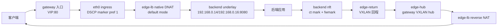

# edge-lb 架构说明

## 当前目标

当前运行时不需要外部负载均衡器、容器运行时或第三方 LB API。edge-lb 自己维护
监听配置、目标组、native DNAT/SNAT 数据面、VXLAN 回程和 HA 控制面。

edge-lb 将 native default DNAT、DSCP 标记和 VXLAN 回程封装成一个可部署的四层
负载均衡 agent。核心路径要求后端服务看到真实客户端 IP，因此默认使用不改写源
地址的 native default 模式。

## 角色边界



- gateway：唯一管理入口，负责监听/目标组 API、native DNAT eBPF、DSCP eBPF、
  `edge-hub`、xDS-like gRPC 控制面、UI/API 和 HA。
- backend：只连接 gateway xDS，接收快照后配置 `edge-return`、nft、策略路由
  和 MSS clamp；不运行 HA、不保存业务配置、不提供管理 UI。
- target group：配置后端地址、权重和健康探测；listener 配置监听 VIP、监听端口、
  转发目标端口、协议、策略以及目标组引用。

## 控制面

backend 启动后按 `[backend.xds].gateway` 连接 gateway gRPC。注册请求上报
`node_name`、实际 `public_ip`、实际 `underlay_ip`，以及 IP 发现模式和来源
（如 `auto/stun`、`auto/udp_source`、`static/config`）。gateway 在内存维护活动
订阅，断线即移除，避免 UI 展示失效节点。VXLAN 节点页面和自动配置目标组的
backend 选择只使用当前活动订阅；已经下线的节点不会展示，也不会参与目标组生成。
edge-lb 不持久化 VXLAN/backend 在线列表。overlay 分配只在当前进程内的活动订阅
映射中保持稳定。

backend 每次收到 snapshot 后，会在设置 `edge-return` 前做本机预检查：
planned overlay CIDR 是否和本机非托管网卡网段重叠、planned overlay IP 是否已被
其他网卡占用、policy rule priority 是否被其他规则占用、return route table 是否
已有非 edge-lb 预期路由，以及主路由表是否已有覆盖 overlay 网段的非 VXLAN 路由。
检查结果不直接阻断收敛，而是随 xDS ACK/NACK 上报给 gateway，gateway 在活动订阅
和 VXLAN 节点页面展示；冲突消失后下一次 ACK 会自动清空展示。gateway 侧构建
快照时读取 SQLite 的 `ha_active_gateway/current` 判定 active 网关；该资源引用未知
网关会记录告警并回退到有效网关（backend 保持现有数据面并重试）。

backend 策略路由通过 rtnetlink 收敛，采用 **dump 驱动**方式：每轮收敛先做一次
`RTM_GETRULE` dump、再对每个 edge-lb 表做 `RTM_GETROUTE` dump，全程复用一个
netlink socket。规则层只删除"属于 edge-lb mark/table 范围且不再是期望状态"的
规则，绝不按 priority 段盲删。路由层按表区分所有权：

- **派生表**（id 落在 edge-lb 派生范围内，见下节）为 edge-lb 全量拥有——表内凡
  不符合期望形态的路由直接删除。failover 换网关、网关改 IP、本机 underlay 变化
  留下的残留路由由这里自愈，不存在"判为外来路由而永久 bail"的死角。
- **用户配置表**（bootstrap 的 `[backend.return_path].route_table_id`，如 100）
  只按 edge-lb 路由**形状**触碰（默认路由走 VXLAN 设备、目的为网关 underlay 且
  源为本机 underlay 的主机路由），表内其他程序的路由不受影响。

所有路由写入使用 `NLM_F_CREATE|NLM_F_REPLACE` 原子替换：已正确的路由不会被
先删后建，失败时原有路由保持原位。规则
优先级被外来规则占用时自动顺延，不覆盖。每条 return path 的 DSCP 不在 1..=63 时
直接报错，不再静默截断为 DSCP 0 匹配。

gateway 下发的 snapshot 只包含 backend 回程 VXLAN/DSCP 数据面所需内容：overlay CIDR、
gateway VXLAN 接口名、VNI、VXLAN 端口、MTU、本 gateway 节点信息，以及本
gateway 的 return path contract。contract 包含 gateway underlay IP、
gateway overlay IP、本 backend overlay IP、DSCP、fwmark 和 route table。
backend inventory、公网 IP、业务 listener、target group、目标端口、健康探测配置
和运行期服务投影不进入 backend xDS，也不参与 backend snapshot version 计算。
active gateway 状态和 UDP service port 也不得进入 backend xDS；backend 只按
包上携带的 DSCP 选择对应 return path。

HA 多 gateway 下，backend 会合并多个 gateway stream。只有已收到所有配置中的
gateway snapshot 后才会 apply；缺少任一 gateway 时只保持当前数据面并等待，避免
某一条 xDS 先恢复时把已有 return path 临时收窄成单 gateway。

HA 多 gateway 下，backend 会同时配置多套回程路径。回程 mark 和 route table 由
**(gateway slot, DSCP)** 二元组派生，单一实现在 `config/model.rs`：

```text
slot  = 网关在按 underlay 排序的网关清单中的序号（每台网关独立计算，天然互异）
mark  = 0x1000 | ((slot+1) << 6) | dscp      # slot 0 → 0x1040..0x107f
table = 1000 + (slot+1)*64 + dscp            # slot 0 → 1064..1127
```

不同 gateway 必须使用不同的非零 DSCP，mark/table 的 slot 隔离不能消除相同 DSCP
在分类时的歧义。backend 在所有 IPv4 ingress 的 conntrack original 方向按 DSCP
记录 ct mark，在 reply 方向恢复当前 contract 的 fwmark。基础回程不匹配 L4 协议、
backend port 或 active gateway。

DNAT 目标、健康探测和回包源都是业务地址，不是隧道地址。UDP 不再使用客户端
二元组动态 set，也不再改写成 overlay 源地址；与 TCP 共用 conntrack 五元组。
policy route 把不同 mark 的回包送入对应 gateway 的 VXLAN 下一跳。
`edge-return` 仍持有本地 overlay 地址和 VXLAN FDB peer，但这些地址只用于隧道回程。

DSCP 是受信网络分类标签，不是认证。携带相同 DSCP 的直连流量也会被分类，
必须由网络边界隔离；DSCP 0 禁止作为回程 contract。
详见 [业务地址修复与升级边界](dnat-service-address-fix.md)。

HA 配置写入采用 MASTER 权威、BACKUP 转发并回写副本。监听、目标组和自动配置
目标组会同步，但监听的 VIP 不作为副本数据传播：每台 gateway 本地自动加入自身
underlay IP，L2 共享 VIP 由本地 HA 状态绑定并通过 GARP 宣告，再写入本机 native
eBPF。这样备机不会错误绑定主机的 underlay 或把共享 VIP 当成普通监听字段复制。

## 数据面

1. 客户端访问 gateway 的监听 VIP 和端口。
2. gateway `eth0 ingress` 上的 DSCP eBPF 只匹配 default-mode listener 的 VIP 端口，将
   DSCP 设为 EF，同时保留 ECN bits。
3. gateway native DNAT 将目标改写为目标组业务 IP（名称引用解析为 backend underlay），
   不改客户端源 IP；按业务目标路由，不自动替换成 overlay。
4. backend 对 IPv4 ingress 上 DSCP 命中的 original-direction 连接设置 ct mark。
5. TCP/UDP reply 方向恢复当前 contract 的 fwmark，保留业务源 IP。
6. backend 策略路由将已标记回包送入 `edge-return`，经 VXLAN 返回对应 gateway。
7. gateway `edge-hub ingress` 上的 native reverse NAT 恢复监听 VIP 后返回客户端。

没有匹配回程 DSCP 的新连接不被自动加入 VXLAN 回程。UDP 多地址主机的服务应绑定
业务 IP 或使用 IP_PKTINFO 保持回复源地址；不能依赖 edge-lb 猜测改写。

## 配置和持久化

- `/etc/edge-lb/config.toml`：bootstrap 配置，只保存本机身份、自动发现、角色参数。
- `/var/lib/edge-lb/edge-lb.sqlite3`：gateway 的监听、目标组、自动配置模板、
  HA 配置、通知配置、运行态清理边界和健康观测数据，由 SeaORM SQLite
  repository 统一读写。
- 监听与目标组由 `storage/proxy_config.rs` 读取同一 SQLite 快照；新增、修改、
  删除及整批导入校验资源和 HA 状态的预期版本，再在同一事务提交两份文档、
  `proxy_replication/config` 待复制游标及版本记录。
  并发版本变化会重新读取并校验引用关系。读取接口不补写配置，空列表也是有效配置。
- native listener/health 投影不是业务权威，不能用于反向恢复监听或推断目标组。
  配置提交后才通知数据面收敛；投影重建保留仍有效的健康观测并移除失效记录。
  SQLite 提交不等于 eBPF 已应用，也不等于 HA 对端已提交。监听/目标组现在由
  独立 worker 重试最新完整快照；副本校验配对身份、业务版本和当前角色，拒绝乱序。
  仲裁任期、晋升前追平及客户端操作去重尚未完成。
- backend 也使用本机 `edge-lb.sqlite3`，但只为策略路由保存
  `route_ownership/local` 创建记录（当前 boot ID、网络命名空间、规则和路由标识）。
  该记录不属于 HA 业务副本，不在 gateway 之间同步；部署必须保留本机 state_dir。
  `route-ownership.lock` 只用于本机 apply/cleanup 互斥，不是配置文件。
- eBPF map、flow map、TC attachment、VXLAN/FDB 和策略路由是运行时内核状态，
  由 gateway/backend heal 幂等收敛，不作为业务配置文件持久化。

## 目标组运行态

native 模式不把后端目标作为独立的配置资源。目标组中的每个后端目标会结合监听
目标端口展开到 eBPF runtime map，并由 probe worker 更新健康状态。目标组页面
展示目标和探测状态；内部 target key 只是数据面派生标识，不参与 listener
配置引用，也不作为 API 资源暴露。

## HA 边界

目标 HA 是带连接同步的 Active/Standby。MASTER gateway 权威维护监听和目标组，
BACKUP 通过受认证的 peer HTTP API 接收监听/目标组完整快照；native flow map 通过
受信任的 HA 通道同步。这两类同步的数据源、版本和时效要求不同。
切换时只有 MASTER 绑定 VIP、发送 GARP 并承担入口流量，BACKUP 保持数据面待命。
backend 同时维护两个 gateway 的 VXLAN 回程信息，并依据 gateway 独立的 DSCP/mark
派生值选择正确的回程路径。

HTTP API 的 4 个普通工作线程负责管理请求和 BACKUP 向 MASTER 的同步转发；
仅本地落盘、不再调用对端的副本写接口由独立工作线程接收，避免回写等待普通线程。
两类待处理队列各限 32，满载返回 503；请求仍经过同一来源和 token 校验。
HA HTTP client 使用共享连接池和逐请求认证，直接连接配置的 peer，不跟随重定向。
监听/目标组的持久化最新状态发送槽负责重试，业务版本负责乱序拒绝；不能仅靠
工作线程隔离保证一致性。HA 写接口的 202 只表示 MASTER 配置与待复制状态已提交，
副本可见性需通过 `/api/v1/ha/proxy-config-sync` 校验。通知和模板复制暂未迁移。
UI 使用 202 响应的可见性版本下限查询本机复制游标，最多等待 30 秒；BACKUP 追平后
刷新当前列表，MASTER 收到匹配 ACK 后才显示副本确认。超时仅提示同步尚未确认，
不重发已提交的业务操作。下限可能包含并发后续提交，不是恰好一次的操作回执。
API/mock 回归已覆盖此流程，浏览器实际交互和真实双机验收仍未完成，不能直接当作可部署版本。
独立 `ui serve` 在 gateway 角色下也运行配置复制 worker，但不启动 BFD 或数据面；
必须独占 state_dir，不能与 gateway daemon 共用数据库运行。生产二进制的双进程测试已
覆盖 HTTP 鉴权、转发、SQLite 落盘、进程重启重试和停机调整角色后的写入限制；
该控制面测试不替代真实链路的自动选主及无损切换验收。
