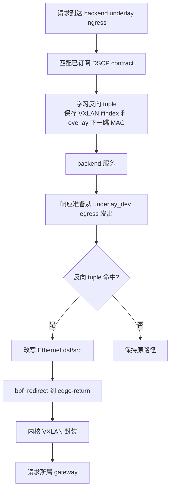
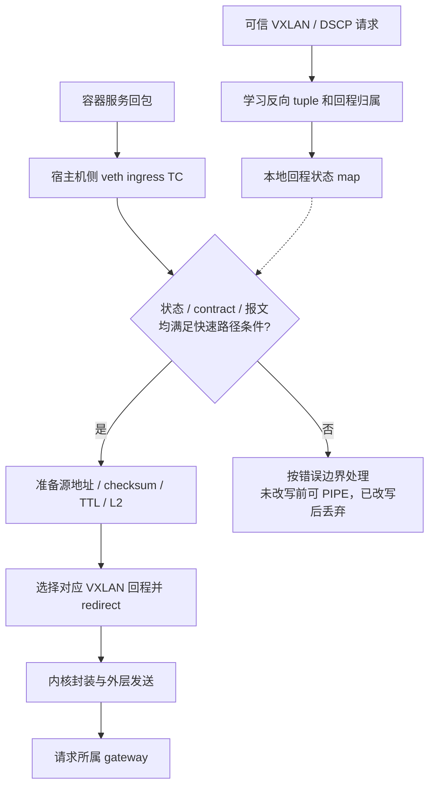
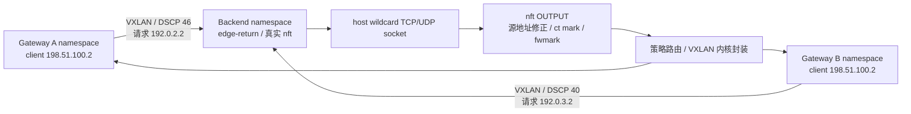

# Backend 回程优化方案

> 地址语义更新：本文基于旧 overlay 正向目标、UDP 二元组学习的诊断/计划为历史记录。
> 已确认改为业务 IP 正向与 DSCP/conntrack 统一回程，见 [修复说明](dnat-service-address-fix.md)。
> 旧 UDP 学习、源地址修正及其有限保护方案不再是运行契约；后续优化必须以新契约为基线。

## 状态与目标

本文记录 `patch` 分支 backend Redirect-only 回程优化。旧 nftables/policy-route
回程只作为迁移前事实和基线，不再作为最终运行路径；运行时代码只管理当前版本的 TC
eBPF 程序和 pinned map，不自动删除旧 nftables table、policy rule、route table 或
`/etc/iproute2/rt_tables` 条目。旧状态清理按
[迁移说明](backend-redirect-only-migration.md) 人工执行。

当前实现采用 backend `underlay_dev ingress` 学习可信 DSCP 请求，`underlay_dev
egress` 命中反向 tuple 后通过 `bpf_redirect()` 送入 `edge-return` VXLAN 设备。回程
目的 gateway 来自已订阅 VXLAN/DSCP contract，二层下一跳由 userspace 观测 gateway
overlay 路由和邻居项后写入 eBPF map，不从业务端口、target group 或 active gateway
状态派生。

gateway 的 TC direct redirect 方案见
[正向设计](tc-direct-redirect-fast-path-plan.md)，解封装后的客户端转发见
[gateway 回程设计](gateway-return-path-optimization-plan.md)。

第十五批补充规则顺序、真实过期和显式 overlay 源地址测试，结果及待确认修复范围见
[UDP 回程归属诊断](udp-return-ownership-diagnosis.md)。UDP 生产语义仍未修改。

开发在 `patch` 分支进行，全部实现并完成验证后再合并 `master`。不增加运行期开关、
环境变量、构建 feature 或 `return_engine` 配置项；最终 backend return path 只保留
Redirect，不保留 nftables/Redirect 双模式兼容语义。

目标是减少 backend 回包进入 VXLAN 之前的转发开销。需区分两种实际拓扑：

- host 网络服务：回包由宿主机协议栈产生，物理网卡 TC egress 已经过较多协议栈路径。
- 独立容器网络服务：回包到达宿主机侧 veth ingress 时，仍有机会跳过宿主机后续
  bridge、IP forwarding 和相关 netfilter 路径。

不为获得 hook 专门新增 veth，不假设把 nft 规则改成 BPF 就会提高性能。当前仓库
`tools/backend-server/compose.host-network.yml` 使用 host 网络；线上模式须通过检查
确认，不能仅根据使用 nerdctl compose 就认定存在可用的容器 veth 路径。

## 不变的约束

- backend 只订阅 VXLAN/DSCP return-path contract；不下发 listener、业务端口、
  target group、负载均衡算法或 active gateway 状态。
- 回程归属来自可信请求中的 VXLAN/DSCP 信号，业务 tuple 来自实际数据包学习。
  本地学习端口不等于控制面下发服务端口。
- 使用同一套 contract 派生 Redirect 状态，不建立第二套管理资源或配置语义。
- backend 不提供 `return_engine` 选择，不允许用户在 nftables 与 Redirect 之间切换。
  nftables 只作为当前已部署版本和迁移前基线的事实描述，不是最终验收路径。
- backend 不重新选择负载均衡目标，也不自行推断哪个 gateway 是 MASTER。
- 保持 gateway 现有 flow key、reverse NAT、HA xSync 和 flow persistence 语义。
- 继续使用内核 VXLAN 封装；本阶段不手工拼装外层报文。
- metrics HTTP 端口仍只在 gateway 暴露。backend PoC 通过本地诊断读取统计。

## 当前实现

主要代码：

- `edge-lb/src/linux/backend_redirect.rs`：加载 backend Redirect eBPF、解析 gateway
  overlay 路由邻居、发布 DSCP contract map，并挂载 backend underlay ingress/egress TC。
- `edge-lb/src/linux/return_path.rs`：Redirect-only facade，只调用
  `backend_redirect::apply/cleanup/heal`，不再应用 nft/policy-route。
- `edge-lb-ebpf/src/backend_redirect.rs`：ingress 根据 DSCP 学习反向 tuple；egress
  命中后只改 Ethernet header，并 `bpf_redirect()` 到 VXLAN ifindex。
- `edge-lb/src/role/backend.rs`：VXLAN 设备、peer 和本地 overlay 地址管理。



该路径不依赖 backend 感知 listener 服务端口或 active gateway；请求从哪个 gateway
过来由可信 DSCP contract 分类，回程通过对应 gateway overlay 邻居返回。

## 候选范围与收益边界

| 场景 | 决策 | 可减少的开销 | 保留的开销 |
|---|---|---|---|
| host 网络服务 | 先测量，暂不选定快速路径实现 | 需证明存在可更早处理回程的 hook 和明确热点 | 应用、TCP/UDP、本地输出及 VXLAN 路径 |
| 已有独立容器网络 | 有条件进入 veth ingress TC PoC | 宿主机后续 bridge、内层路由、相关 netfilter 转发路径 | 容器协议栈、veth、map 查询、VXLAN 和外层发送 |
| 需要容器 DNAT/SNAT、复杂 CNI 策略的网络 | 首版排除 | 不承诺 | 保留既有路径 |

host 服务的回包不会先经过物理网卡 ingress；XDP ingress 无法直接捕获本机应用生成的
回包。在物理网卡 TC egress 做 redirect，也无法省掉该包此前已经执行的 OUTPUT、
conntrack 和路由工作。

host 网络后续若评估 cgroup/socket hook，必须先明确内核能力、TCP/UDP 覆盖、路由查询
时机和 UDP 源地址语义，并单独评审。本方案不把尚未验证的早期 hook 作为交付承诺。

## Redirect-only 目标路径

准入条件：容器无需依赖被跳过的 NAT、过滤、限速或网络策略；回包 tuple 能与可信请求
建立无歧义对应；现有慢路径在该拓扑中已通过 TCP/UDP 验证。



该路径不绕过容器内部协议栈，也不等于绕过整个主机上的所有内核处理。
某些 CNI 的 NAT、策略或限速正处于拟绕过的位置；未证明语义等价的环境不能作为
Redirect-only 验收环境。

## 回程状态学习

### 信任与归属

只对来自已配置 VXLAN 路径、匹配已知 DSCP 的请求建立状态。需要同时核对入口、
VNI/peer 与 contract 的对应关系；不能接受任意普通接口上的 DSCP 值作为回程授权。

学习记录标识请求所属的 contract，而不是独立保存一套 active gateway 逻辑。
同一客户端经两个 gateway 到达时，按请求证据处理，不允许静默 last-writer-wins。

### 拟议数据模型

以下是逻辑字段，尚未冻结 BPF ABI 或 map 容量：

| 对象 | 字段与职责 |
|---|---|
| 回程状态 key | 协议、客户端 IP/端口、服务 IP/端口、必要的本地网络域标识 |
| 回程状态 value | contract 标识和代次、预期 overlay 源地址、最近请求时间、有效期、歧义标志 |
| contract 投影 | DSCP、VNI、gateway underlay/overlay、backend overlay、设备及邻居信息 |
| 本地端点投影 | 容器网络域、挂载设备与地址之间的关系，用于避免网络命名空间 tuple 冲突 |

本地端点投影只来自主机网络拓扑，不从 xDS 接收业务端口。不能把不同位置观察到的
ifindex 直接当作同一个网络域标识；请求学习点与回包 hook 必须使用一致的映射。

完整 key 必须能在两个方向中无歧义构造。容器 NAT 或 wildcard UDP 导致源地址不同、
无法唯一匹配时，不降级为只按客户端地址和端口匹配并强行 redirect。

现有 nft UDP set 的 key 是客户端 IP/端口，且每条 return path 独立维护。它不能证明
完整 tuple 不冲突。因此不能用“BPF miss 后交给 nft”掩盖双 gateway 同 tuple 歧义；
Redirect-only 实现必须在自身学习状态中解决或显式拒绝该场景。

### 生命周期

- 只有可信请求才能建立或改变回程归属；回包不能凭自身 DSCP 创建归属。
- 初期 UDP 学习有效期与现有 30 秒请求学习窗口对齐；TCP 生命周期单独定义并测试，
  不直接套用 UDP 窗口。流量刷新不得无限保留已撤销的 contract。
- contract 修改、peer 删除、设备重建使关联状态失效。需使用代次检查，防止 ifindex
  或 contract 标识复用后把旧流发到新出口。
- 邻居失效、map 满和 LRU 淘汰必须可观测；容量按实测活跃 tuple 数量确定，不能直接
  复制 gateway flow map 容量。
- backend 不增加 gateway flow snapshot 的字段，也不假设已有 gateway 持久化机制
  能恢复 backend 新增状态。

## VXLAN 发送与报文语义

优先验证现有 VXLAN 设备是否能通过正确的内层 L2、neighbor/FDB 状态，把 redirect
报文发给请求对应的 gateway。多 gateway 场景必须逐条验证，不能固定一个目的 MAC。

Linux 还提供 `bpf_skb_set_tunnel_key()` 与 collect-metadata 隧道设备配合设置 tunnel
metadata 的能力。若现有设备无法满足定向发送，再提交 metadata 模式的独立变更设计，
说明设备生命周期、FDB、MTU、与慢路径共存及回滚；不在 PoC 中隐式切换设备模式。

快速路径需在修改报文前检查：

- IPv4、非分片、完整 TCP/UDP header；不支持的报文走已验证的原路径。
- contract 和唯一回程归属有效，出口、邻居、内层 MAC 与 VXLAN peer 一致。
- 修正后源 IP 与 gateway reverse flow key 一致，不能任意使用 backend underlay IP。
- IP/L4 checksum 正确，保留 IPv4 UDP zero-checksum 语义。
- 按实际 L3 转发行为处理 TTL，避免少减或重复扣减；TTL 耗尽交给能生成 ICMP 的路径。
- 内层与外层 MTU、封装开销、GSO/GRO、checksum offload 均满足已验证条件。
- 被跳过的 MSS clamp、过滤、NAT 和 CNI 策略没有必需的业务作用。

首次 PoC 保留原有 SYN/MSS 处理路径，只有已经学习且验证可用的后续报文进入快速路径。
不能由此假设所有 TCP 分段和 offload 场景自动正确，仍需单独测试。

## 回退与重启

回退须在源地址、MAC、TTL 等修改前决定。已完成部分改写后的 helper 失败需要明确的
丢弃或恢复处理，不能把半改写报文直接交给旧路径；redirect 提交后发生的发送失败也
无法在同一次程序调用里重新回退。

Redirect-only 不保留现有 nft 学习规则作为运行期兜底。请求学习、冲突判定和回程归属
只能有一套语义，不能把 Redirect miss 转交给 nft 后形成两套选择规则。

| 情况 | 处理要求 |
|---|---|
| Redirect 未就绪或拓扑不满足条件 | 拒绝进入最终验收；迁移阶段可回滚到旧版本，但不作为同一版本运行模式 |
| 学习未命中、过期或 map 压力 | 未改写前可交回内核；已开始改写后必须丢弃或完整恢复，且计数 |
| tuple 歧义 | 显式拒绝发布对应状态或计数暴露，不能按规则顺序或隐式 fallback 选择 |
| peer/contract 变更 | 使旧快速状态失效，先确认慢路径收敛再恢复加速 |
| backend 进程重启 | 挂载 Redirect 程序并等待新请求重建归属；不承诺已有 backend 本地状态自动恢复 |
| 主机重启 | 需要新请求重建归属；不承诺已有会话自动恢复 |

旧 `nft::apply` 会通过重建表清空动态学习状态；该行为只用于迁移前基线分析。
Redirect-only 的挂载、巡检和配置变更必须有自己的状态生命周期测试。

## 观测与验证

backend 暂不增加 metrics HTTP 服务。PoC 使用本地 BPF 计数器、诊断命令和采样工具，
读取开销须计入测试；下列计数器名称仅为设计建议：

- `learned`、`learn_conflict`、`learn_update_failed`。
- `redirect_submitted`：仅表示提交 redirect，不表示远端收到报文。
- `fallback_state_miss`、`fallback_expired`、`fallback_contract_changed`。
- `fallback_neighbor_miss`、`fallback_mtu`、`fallback_unsupported`。
- `rewrite_error`、可获得的设备发送错误和 drop 统计。

### 环境检查

以下命令在 backend 执行，尖括号字段由实际环境替换；它们是验证计划，不是已执行结果。
只读采样输出需去除凭据和公网地址后再写入报告。

```bash
cd /mnt/netdiscover
sudo nerdctl compose ps
sudo nerdctl inspect --format '{{.HostConfig.NetworkMode}}' <container>
ip -d link show
ip -d link show edge-return
bridge fdb show dev edge-return
ip neigh show dev edge-return
ip rule show
ip route show table <return-table>
ip route get <client-ip> from <backend-overlay-ip> mark <return-mark>
sudo nft -a list table inet <backend-nft-table>
sudo tc -s filter show dev <host-veth> ingress
sudo ethtool -k <underlay-dev>
```

### 功能与故障矩阵

需覆盖 TCP、connected/unconnected UDP、wildcard bind、同一客户端多源端口、多个服务
端口、双 gateway 相同客户端 tuple、UDP 学习到期、邻居失效、map 压力、设备重建、
contract 撤销、进程/主机重启、HA 切换，以及分片、MTU、GSO/checksum 边界。

容器 NAT/CNI 场景即使被首版排除，也应验证其不会误进入快速路径。gateway 的
`return_miss`、实际回程源 IP、流所属 gateway 和业务成功率必须一起检查。

```bash
sudo tcpdump -ni <host-veth> -nn 'host <client-ip> and port <service-port>'
sudo tcpdump -ni edge-return -nn 'host <client-ip>'
sudo tcpdump -ni <underlay-dev> -nn 'udp port <vxlan-port>'
```

测试机基础探测：

```bash
printf 'discover\n' | nc -N -w 5 <vip> <service-port>
(printf 'discover\n'; sleep 1) | nc -u -w 5 <vip> <service-port>
```

### 性能对照

对同一受支持拓扑测试固定基线和 `patch` backend 优化提交构建的产物，记录 commit 与
二进制摘要。gateway 版本、配置、算法、并发、
源端口样本、请求响应大小、timeout 和测试时长保持一致。使用 `ha-bench` 并将实际完整
命令、版本及网络模式写入报告，不把 host 与 bridge 的差值作为 fast path 的收益。

每组至少重复三轮，交替测试顺序，并记录：

- CPS/RPS、PPS、吞吐、成功率、超时和 p50/p95/p99。
- backend/gateway 的 CPU、softirq、丢包、TCP 重传以及每成功请求的 CPU 成本。
- 快速路径提交率、各类回退比例、gateway return miss。
- VXLAN/offload 配置、主机 CPU/内存规格和频率、内核版本、CNI/容器模式。

先预热并单独测试冷启动、持续负载和状态过期。不能仅凭 `redirect_submitted` 增长认定
收益；要以端到端成功率、延迟及 CPU 成本确认。

## 实施顺序与验收

1. 确认线上服务网络模式，测量现有回程热点。若只有 host 网络，本轮先交付测量结论。
2. 在隔离的独立容器网络中验证慢路径，确认无必需 NAT/策略被绕过。
3. 完成 tuple 归一化、冲突规则和设备投影设计，提交架构确认。
4. 在中间提交实现只学习和计数的 shadow 阶段，验证与现有回程归属一致；不保留用户模式开关。
5. 接入 Redirect-only，完成报文、状态生命周期与错误边界测试。
6. 完成性能对照和两端完整回归后再合并 `master`，中间实现仅在 `patch` 验证。

验收要求：backend xDS contract 无新增业务信息；不误加速排除场景；没有新增错路由、
跨 gateway 误投或 UDP 源地址错误；没有 `return_engine` 配置或 nft/Redirect 双模式；
性能收益超过重复测试波动。不预设提升百分比，未测得收益则回滚该 patch，而不是在
同一版本中保留可配置 nft fallback。

## P3 前置核查与回归（2026-09-16）

### 线上网络模式

本轮仅通过 SSH 只读执行 `hostname`、`nerdctl ps`、`nerdctl inspect` 等命令，
没有修改服务器配置、重启服务、部署产物或发起压力流量。核查结果：

| 节点 | 主机名 | 容器 | 镜像 | 实际 NetworkMode |
|---|---|---|---|---|
| backend-a | VM-0-14-ubuntu | netdiscover-netdiscover-serve-1 | docker.io/1228022817/netdiscover:v0.1.6 | host |
| backend-b | VM-0-13-ubuntu | netdiscover-netdiscover-serve-1 | docker.io/1228022817/netdiscover:v0.1.6 | host |

实际执行的命令形式如下，访问地址已替换为占位符；backend-a 经 gateway SSH 跳转：

```bash
ssh -o BatchMode=yes -o ConnectTimeout=8 <backend-b-access> hostname
ssh -o BatchMode=yes -o ConnectTimeout=8 <backend-b-access> "sudo -n nerdctl inspect --format '{{.Name}} network={{.HostConfig.NetworkMode}} pid={{.State.Pid}}' netdiscover-netdiscover-serve-1"
ssh -o BatchMode=yes -o ConnectTimeout=8 -J <gateway-access> ubuntu@192.168.0.14 hostname
ssh -o BatchMode=yes -o ConnectTimeout=8 -J <gateway-access> ubuntu@192.168.0.14 "sudo -n nerdctl inspect --format '{{.Name}} network={{.HostConfig.NetworkMode}} pid={{.State.Pid}}' netdiscover-netdiscover-serve-1"
```

结论仅为拓扑适用性：两台测试服务的回包不经过容器 veth ingress，本文拟议的容器
fast path 不覆盖当前测试服务。尚未采集代表性负载下的热点，不能把此结论扩大为
backend 无优化空间，也不能为进入 PoC 而自行改成 bridge 网络或另增 veth。

### 实际慢路径测试

新增 [nft 内核测试](../edge-lb/src/linux/nft/kernel_tests/mod.rs) 和独立
[拓扑夹具](../edge-lb/src/linux/nft/kernel_tests/topology.rs)。第八批曾通过 `nft -f -`
加载生产规则；用户重申避免命令行依赖后，第九批已改为与生产共用的原生 nf_tables
netlink batch。拓扑、FDB、策略路由、接收统计也改用类型化 rtnetlink，挂载使用 syscall。
没有 mock nft、改短生产 timeout 或增加运行期开关。构建测试镜像已移除 iproute2 和
nftables 安装项；当前测试不会执行下方人工诊断示例中的命令。
共享 namespace 生命周期位于 `linux/test_support.rs`，仅测试构建可见；gateway
原有网络测试复用它，不依赖 backend 测试模块。



两个 gateway namespace 使用相同的客户端 IP，隔离模拟同一客户端经两条 gateway
路径请求。正向不安装 gateway NAT，也不运行 HA 控制面；回程路由由夹具显式建立，
不是生产路由 ownership 收敛成功证据。每个 peer 的 VXLAN 接收计数和实际 socket
源地址/内容共同验证正常回包，没有只检查规则字符串。

| 测试 | 实际结果 |
|---|---|
| 两个 DSCP、不同客户端源端口 | TCP 和 wildcard UDP 正常返回各自 gateway；UDP 源地址修正为对应 backend overlay |
| connected/unconnected UDP client | 两种客户端 socket 用法均正常；此处不声称覆盖所有 backend socket 模式 |
| 已知 DSCP，但普通 underlay ingress | 请求到达服务，但不建立 UDP 动态 set 元素 |
| VXLAN ingress，但未知 DSCP | 请求到达服务，但不建立 UDP 动态 set 元素 |
| 同客户端 IP/端口、两个 gateway、不同服务端口 | **复现错误归属**：B 请求先到、A 请求后到，A:8080 的回复仍发到 B，源变为 B 对应的 backend overlay:8080；A 未收到回复 |
| 同客户端 IP/端口、两个 gateway、同一服务端口（第十四批） | **同样复现错误归属**：两个请求都访问 8080，B 先、A 后，A 的回复仍被送往 B；不是只在不同服务间冲突 |
| 对同一配置重新加载 nft ruleset | 两个 UDP 动态 set 被清空；既有 TCP 连接继续可用，新 UDP 请求重新学习后恢复正常回复 |

错误归属用例是现状刻画，不是期望产品行为。原因是两个 `udp_reply_<mark>` set 的
key 均只有客户端 IP/端口，两个 OUTPUT 修正规则都匹配，后执行的规则覆盖源地址和
mark。此用例中最后到达的请求属于 A，仍不能改变规则顺序造成的选择；并非可靠的
“最近请求决定 gateway”。修复后应把测试改为正确归属断言，不能为维持该测试恢复错误语义。

第十四批新增 `udp_same_service_after_gateway_change_can_reply_via_previous_gateway`，
复用原生 namespace/VXLAN 夹具，仅改变服务端口是否相同。测试没有执行生产 HA 切换、
GARP、gateway NAT 或 xSync，所以不能直接解释四机切流测试中的 4 次超时。它证明
仅给学习 key 增加服务端口不能解决同一服务跨网关归属问题。不能用放宽 rp_filter、
调整规则顺序或静默 last-writer-wins 作为修复；具体关联语义需先同步用户确认。

聚焦运行及全量运行命令：

```bash
make test TEST_ARGS='linux::nft::kernel_tests -- --nocapture' DOCKER_PRIVILEGED="docker run --rm --privileged -e RUST_TEST_THREADS=1 -v $PWD:/src -v edge-lb-cargo:/usr/local/cargo/registry -w /src edge-lb-build:bookworm"
make test DOCKER_PRIVILEGED="docker run --rm --privileged -e RUST_TEST_THREADS=1 -v $PWD:/src -v edge-lb-cargo:/usr/local/cargo/registry -w /src edge-lb-build:bookworm"
```

关键拓扑的等价人工诊断命令如下，仅供一次性 namespace 中复现，不可用于线上复制。
第八批曾实际执行这些命令，第九批起测试直接调用 netlink，不再依赖这些可执行文件：

```bash
ip rule add pref 100 fwmark 4206 table 1110
ip route add table 1110 default via 192.0.2.1 dev edge-return onlink
ip route add table 1110 198.18.0.1/32 dev underlay0
ip route add table 1110 198.18.0.3/32 dev underlay0
ip neigh replace 192.0.2.1 lladdr 02:00:00:00:01:01 nud permanent dev edge-return
bridge fdb replace 02:00:00:00:01:01 dev edge-return dst 198.18.0.1
nft -j list set inet edge_lb_return udp_reply_106e
```

本批新增 3 项测试，全量单线程 298 项单元测试和 1 项 HA 集成测试通过；
`make check`、`cargo fmt --all --check`、`git diff --check` 通过。
全部网络变化仅发生在本地隔离 namespace；没有部署、HA 网络切换或性能结论。

### 下一步决策边界

- 在 UDP 歧义解决前，不能把无命中的新 BPF 学习状态交给现有 nft 后宣称回退正确。
- 若改为学习完整业务 tuple、增加唯一候选匹配或定义歧义时的处理，须先提交具体
  规则并确认，同时修订现有约束；不能直接把当前按规则顺序选择的行为复制进 BPF。
- 数据包学习业务端口与 xDS 下发业务端口不同，但目前约束还明确禁止 backend nft
  匹配/写入 service port。此次未改变这项约束，也没有实现第二种兼容学习语义。
- host 网络更早 hook 的选择仍需热点测量和独立评审；本轮未转向 cgroup/socket hook。
- 独立容器网络、相同完整 tuple 的双 gateway 冲突、map 压力、完整 xDS/路由资源
  contract 撤销及双端重启/HA 仍待验证。30 秒自然过期与 nft 层撤销见第十批；
  上述测试不构成 P3 fast path 验收。

### 原生 API 迁移（第九批）

- `nft::apply` 保留可读规则文件用于检查，但执行路径只有原生 nf_tables batch，
  不再派生 `nft`。UDP 动态 set、30 秒刷新、IPv4 源地址及 checksum 修正、mark 恢复、
  MSS 规则保持既有语义；没有借此修复或改写上述 UDP 歧义策略。
- `nftables/udp.rs` 单独编码 UDP 表达式；`nftables/transport.rs` 负责有界 netlink I/O，
  必须收齐请求序号对应的 ACK，后续错误不能被先到达的成功 ACK 隐藏。
- 新增实际内核事务失败回滚测试和分段 ACK/后续错误测试；原来的错误归属刻画用例继续
  通过，表示行为一致而非该缺陷已修复。移除命令依赖后的全量回归为 300 项单元测试和
  1 项 HA 集成测试通过。
- set concat 的字段长度按内核实际解析使用字节数，分别为 4 和 2，总 key 含 padding
  为 8 字节；相关 ABI 依据 [Linux nf_tables 实现](https://github.com/torvalds/linux/blob/v6.12/net/netfilter/nf_tables_api.c)
  核对。测试 XFRM 故障注入按 [Linux XFRM UAPI](https://github.com/torvalds/linux/blob/v6.12/include/uapi/linux/xfrm.h)
  直接发送原生 netlink，不再调用 `ip xfrm`。

此修改不增加 backend xDS 字段，不启用 backend fast path，也未部署至服务器。

### 学习生命周期回归（第十批）

`nft/kernel_tests/lifecycle.rs` 使用原生 API 和真实内核时钟，不缩短生产的 30 秒超时。
沿用前述双 gateway namespace、host wildcard UDP 和静态策略路由夹具：

| 场景 | 断言 |
|---|---|
| 入方向续期 | 首次请求后约 20 秒再请求；首次请求后约 32 秒，学习记录仍存在，回复经正确 VXLAN 返回 |
| 回复不续期 | 最后请求后约 32 秒，记录自然消失；此前的 OUTPUT 回复不能延长记录寿命 |
| 过期后再学习 | 未学习时停止 overlay 源地址修正和对应 VXLAN 回程；新请求重新建立记录后恢复 |
| 撤销一条 nft 回程配置 | 旧表替换清空所有 UDP 学习，包括保留路径；撤销路径的新请求不再获得对应修正，保留路径重新学习后正常回复 |
| 撤销全部 nft 回程配置 | 旧记录不再引导回复；新请求也不能重新建立已撤销路径的回程修正 |
| 恢复配置 | 不恢复旧学习记录，新请求重新学习后两条路径均可正常回复 |

**普通路由不是丢弃保证。** 此拓扑的主路由默认经 gateway A 的 underlay，且 A namespace
本地拥有测试客户端地址。学习过期或所有规则撤销后，wildcard 回复实际以
`198.18.0.2:8080` 为源通过 underlay 到 A，而非以 backend overlay 为源通过 VXLAN 返回；
两个 peer 的 VXLAN 接收计数均不增加。B 的客户端不会在 B 收到这类回复，测试在 A 另设
接收 socket 验证其实际去向。最初“没有学习就收不到任何回复”的测试假设因此已修正，
没有为使测试通过而添加丢弃规则或更改生产行为。

这意味着不能把 30 秒学习记录当作 SIP/UDP 会话持续时间保证：对这里验证的 wildcard
回复场景，最后一次匹配请求超过超时后，单向 backend 发送不能保持这条回程学习。
具体生产网络会直出、不可达还是被防火墙过滤，取决于普通路由与策略，本地测试不推断
线上结果。修复超时策略或 UDP 归属仍须单独确认，不在本批隐式修改。

本批仅测试 nf_tables 规则替换，故意保留夹具的路由、邻居和 VXLAN；不代表生产
xDS 撤销、路由 ownership 清理、HA、重启或性能已验收。

验证命令与结果：

```bash
make test DOCKER_PRIVILEGED="docker run --rm --privileged -e RUST_TEST_THREADS=1 -v $PWD:/src -v edge-lb-cargo:/usr/local/cargo/registry -w /src edge-lb-build:bookworm"
make check
cargo fmt --all --check
git diff --check
```

新增 2 项生命周期测试通过；全量单线程 302 项单元测试和 1 项 HA 集成测试通过，
其余三项检查通过。测试镜像仍不安装 iproute2/nftables，没有新增网络子进程依赖。

### 校验和与异常 ACK（第十一批）

`nft/kernel_tests/packets.rs` 沿用双 gateway VXLAN 夹具，先用普通 UDP 请求建立学习，
再通过 backend 的原生 raw IPv4 socket 向 OUTPUT 注入完整校验和的 UDP 回复。
在 gateway namespace 的客户端地址绑定 raw 接收 socket，检查解封装后的实际 IPv4
字节；同时要求普通 UDP socket 收到相同内容，并确认对应 VXLAN 接收计数增长。

两条 DSCP 路径分别覆盖空 payload、奇数/偶数长度 payload，以及特制的“源地址改写后
校验和数学结果为零”payload；每种 payload 均测试启用和禁用 IPv4 UDP checksum：

| 项目 | 断言 |
|---|---|
| IPv4 源地址修正 | underlay 源地址变为对应 backend overlay，IPv4 header checksum 正确 |
| UDP checksum 为零 | 改写后仍为零，不将禁用校验和误变成启用 |
| UDP checksum 非零 | 使用改写后的源地址重新核算 pseudo-header，校验结果正确 |
| 计算结果为零 | 在线上传输 `0xffff`，不误写为表示禁用校验和的 `0x0000` |
| 其余内容 | 目标 IP、源/目标端口、UDP 长度和 payload 不变，普通 UDP socket 正常接收 |

使用完整 raw IPv4 包是为了明确覆盖非 offload 的 checksum 增量修正，不宣称本测试
覆盖所有 NIC checksum/GSO offload 组合。已有普通 socket 测试仍独立保留。
校验和 oracle 移到测试共享层 `linux/test_support/packet.rs`，供 Gateway 字节码测试和
Backend 包级测试复用；没有让 nft 测试依赖 redirect 内部实现。

`nftables/transport.rs` 增加三项异常 ACK 回归：合并/乱序回复及未知序号、成功 ACK 后的
错误、短帧和非法长度、意外消息类型、dump interrupted 标记及非法错误码。
解析时明确拒绝正错误码和 `i32::MIN`，避免对最小负数取负导致溢出；合法 ACK 的语义不变。
这些是解析器故障注入，不代表内核曾在线上返回过此类非法错误码。

本批不修改学习 key、超时、归属选择或 backend xDS 字段，不引入外部网络命令。
Backend fast path、生产完整收敛、HA 网络切换及性能仍未验收。

验证命令：

```bash
make test TEST_ARGS='linux::nft::kernel_tests::packets -- --nocapture' DOCKER_PRIVILEGED="docker run --rm --privileged -e RUST_TEST_THREADS=1 -v $PWD:/src -v edge-lb-cargo:/usr/local/cargo/registry -w /src edge-lb-build:bookworm"
make test DOCKER_PRIVILEGED="docker run --rm --privileged -e RUST_TEST_THREADS=1 -v $PWD:/src -v edge-lb-cargo:/usr/local/cargo/registry -w /src edge-lb-build:bookworm"
make check
cargo fmt --all --check
git diff --check
```

聚焦包级测试通过；全量单线程通过 306 项单元测试和 1 项 HA 集成测试，编译、格式和
diff 检查通过。源码子进程扫描仍仅保留约定的 HA hook。未部署、压测或合并分支。

## 回滚

恢复已验证的基线版本，确认 nft/策略路由及学习状态可用，再按程序替换流程移除本功能
拥有的 TC 程序和 map；不依赖运行期开关回滚。
不清理其他 CNI/TC 程序，不顺带重建 VXLAN 或清空 conntrack。若后续批准了隧道设备模式
变更，须另附设备回滚步骤和维护窗口要求。

## 参考

- [现有 VXLAN/DSCP 回程验证](vxlan-dscp-verified.md)。
- [TC direct redirect 设计](tc-direct-redirect-fast-path-plan.md)。
- [Gateway return path 优化](gateway-return-path-optimization-plan.md)。
- [Linux BPF helper 定义](https://github.com/libbpf/libbpf/blob/master/src/bpf_helper_defs.h)：
  `bpf_skb_set_tunnel_key` 与 tunnel metadata 能力。
- [Linux tunnel selftests](https://github.com/torvalds/linux/blob/master/tools/testing/selftests/bpf/progs/test_tunnel_kern.c)：
  内核隧道 BPF 用法参考，不作为当前 edge-lb 已兼容所有内核的证明。
- [nftables chain 文档](https://wiki.nftables.org/wiki-nftables/index.php/Configuring_chains)：
  route 类型 OUTPUT chain 修改 mark/header 后的重新路由语义。
