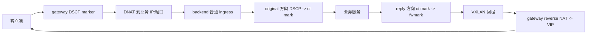

# DNAT 业务地址与 DSCP 回程修复

## 统一语义

- 显式目标地址就是业务地址，关联 backend 名称不能覆盖它。仅未指定地址的名称引用
  解析为 backend underlay。健康探测、健康状态身份与 native target 使用同一地址。
- 正向 DNAT 后按业务地址路由，保留客户端 IP；不因目标属于某个 backend 而改成 overlay。
- backend 在所有 IPv4 ingress 的 conntrack original 方向按 DSCP 标记连接。
  reply 方向只恢复当前 contract 的 fwmark，不改变业务源地址。策略路由经 VXLAN
  送回对应 gateway，gateway reverse NAT 恢复 VIP/端口。
- backend xDS 仍只接收 VXLAN/DSCP contract，不增加服务端口、监听或 active gateway。
- TCP/UDP 共用 conntrack 完整五元组；删除旧 UDP 二元组动态 set、30 秒学习和
  overlay 源地址改写，不保留兼容分支或新增配置开关。



## 边界与升级

DSCP 是受信网络内的分类标签，不是认证。携带相同 DSCP 的直连流量也会被分类，
应在网络边界隔离这些 codepoint。DSCP 0 不可用；范围为 1..63。多个 gateway 的
DSCP、非零 mark 和路由表必须无冲突，否则应用前拒绝，保留已有内核规则。
bootstrap 的 gateway 清单不等于已收到的 contract，不能因此阻止 xDS 订阅启动。

普通单 underlay 主机的 UDP wildcard socket 已纳入隔离内核回归。
多地址主机若内核选择了不同业务源 IP，应由服务绑定目标地址或使用 IP_PKTINFO；
edge-lb 不再用客户端二元组猜测源地址。相同客户端 IP/port 访问不同服务端口时，
连接五元组可区分回程。完全相同五元组经两个 gateway 先后进入时，最近的已分类
请求更新连接 mark；这不提供应用事务级别的延迟回复归属保证。

目标地址从 overlay 切换到业务 IP 会改变 flow 身份和一致性 hash 的目标身份。
升级不能承诺已有连接无损：应排空旧 overlay 会话，并协调 gateway/backend 升级；
不要混用新旧回程规则。代码不会为了升级自动清空所有 pinned flow。
磁盘快照只恢复仍匹配业务地址/端口的目标，不再按目标下标将旧 overlay 地址改成
另一地址；这也避免目标组重排时误恢复到不同后端。

## 回归范围

本次验证：master checkout 的 263 项单元测试与 1 项 HA API 集成测试通过；
当前 patch checkout 的 314 项单元测试与 1 项 HA API 集成测试通过。
两份代码的 `make check`、`cargo fmt --all --check` 和 `git diff --check` 均通过。
未执行云服务器部署或新的性能压测。

- 目标解析：显式地址、名称引用、未注册名称、显式 overlay 不被隐式替换。
- 健康检查与 native target 的业务地址一致。
- 六种调度策略的真实 TC 程序测试：TCP、UDP 零/非零校验和，DNAT 到业务 IP，
  reverse NAT 还原 VIP/端口，客户端源 IP 与 DSCP/ECN 保持。
- 双 gateway + 单 backend 隔离网络：业务 IP 入站，TCP、wildcard/显式绑定 UDP
  经相应 VXLAN 回程；connected UDP 客户端仍能接收。
- 完整五元组隔离、相同五元组 gateway 变化、未知 DSCP/DSCP 0 不接管。
- 容器服务转发回包保留业务源地址；reply 携带另一 gateway 的 DSCP 也不会覆盖
  原请求的连接 mark，仍从原请求对应的 VXLAN 出口返回。
- ruleset 重装不丢 UDP/TCP conntrack；撤销 contract 停止恢复旧 mark；
  非法 contract 应用失败后原规则仍有效；原生事务等待全部 ACK。
- 内核测试夹具使用 rtnetlink/syscall，无 ip/nft/tc 子进程。

在仓库目录执行：

```bash
cargo fmt --all --check
make check
make ebpf
make test DOCKER_PRIVILEGED="docker run --rm --privileged -e RUST_TEST_THREADS=1 -v $PWD:/src -v edge-lb-cargo:/usr/local/cargo/registry -w /src edge-lb-build:bookworm"
```

这些是本机 Linux 构建容器与隔离内核回归，不代表四台云服务器已部署、HA 切换无损，
也不是新的性能测试结果。原型阶段基于 overlay/UDP 二元组学习的诊断文档为历史记录，
不能作为此版本的运行契约。
