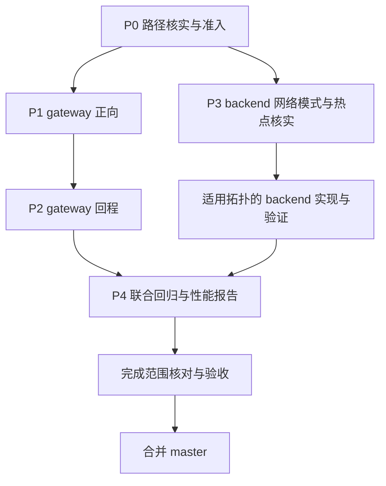
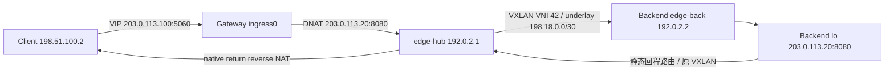

# 转发性能优化实施顺序

所有开发在 `patch` 分支进行，不增加运行期开关。阶段提交用于构建和性能对照；全部
约定范围实现并通过回归后再合并 `master`。本表按依赖排列，不把未实现的方向视为已完成。

## 优先级

| 优先级 | 内容 | 完成条件 | 当前状态 |
|---|---|---|---|
| P0 | 路径核实、出口观察和准入基础 | 识别实际 VXLAN 出口，验证路由/邻居解析；明确策略、TTL、MTU、offload 边界 | 保守主机、TC/TCX、netfilter/XFRM 准入和失效监听已接入；适用主机实测待完成 |
| P1 | Gateway 正向 TC redirect | 新流/已有流、DSCP、VXLAN、健康变化、route 失效和异常回退均正确 | 字节码、自动收敛、发布保护及隔离 VXLAN/L3 实际收发已覆盖；生产完整准入、HA 与性能待验收 |
| P2 | Gateway return redirect | reverse NAT 后 FIB 查询、TTL/L2 改写、HA/flow restore 和错误处理均通过 | FIB redirect、自动准入租约和独立指标已接入；隔离收发/故障回归已通过，生产准入、HA 与性能待验收 |
| P3 | Backend 回程 | 核实网络模式；在适用拓扑验证 tuple 学习、冲突和回程 redirect | 两台测试服务均为 host 网络；已补真实 nft/VXLAN 基线并复现 UDP 归属歧义；热点、语义修复评审及 fast path 待完成 |
| P4 | 联合回归与性能报告 | 阶段构建对照、故障和重启测试、三轮以上重复性能结果 | 待前序完成 |

P1 优先是因为它复用已有 listener/target/flow 决策，出口数量有限；P2 客户端出口更复杂；
P3 还涉及应用发送路径、容器拓扑和 backend 本地学习状态，且 host 网络未必有收益。
XDP 不纳入本轮。P3 若确认线上 host 网络不适用，须记录测量结论并明确范围，不能把
保留原路径描述成已经完成 backend 加速。



## 第一批实现

新增 `edge-lb/src/linux/redirect/`，在 `edge-lb gateway show` 中输出目标路由观察结果。
代码按 `model`、`netlink`、`resolve` 和测试模块分层，由 `mod.rs` 提供小接口；结构约束见
[实现契约](implementation-contracts.md)。

本批行为：

- 复用 SQLite 配置水合后的 native listener 目标地址，不另读 JSON 配置。
- 按目的地址去重，通过结构化 rtnetlink 发起真正的 `RTM_GETROUTE` 查询，不把 route dump
  当作路由选择结果，也不自行实现最长前缀匹配。
- 读取出口设备、L3 MTU、目标或下一跳的邻居 MAC；保留 VXLAN 设备作为实际出口。
- 返回非单播、设备缺失/未启动、不支持的设备或路由、MTU/MAC 无效及邻居不可用等状态。
- 整次读取限制为 3 秒；不触发 ARP、不写路由或邻居、不挂载程序、不修改 BPF map。
- 第一批只在用户执行 show 时采集；第四批才接入 daemon 周期观察，始终不在每包路径做查询。

`resolved` 只表示本次目的地址路由观察具备 L2 信息。它不包含实际客户端源地址、端口、
mark 等上下文，不能证明转发策略允许绕过，也不是可直接写入加速 map 的授权。

单元测试覆盖 next-hop/设备/地址族匹配、邻居状态、MAC、MTU、非转发路由、VXLAN 路径和
查询类型；Linux 实测使用 loopback 完成真实 netlink 查询，并检查去重结果。

## P1 剩余验收工作

1. 验证实际适用主机可以完整通过自动准入，观察 route 自动发布及 submitted 增长；
   不以人工填 map 或单独子条件测试代替，不修改主机安全策略来强行命中。
2. 隔离 VXLAN/L3 拓扑已覆盖 TCP/UDP、TTL、MTU、offload 回退和 DSCP/ECN 保留；
   仍需实机网卡 offload、双 gateway DSCP 回程选择及完整自动发布链路验证。
3. 隔离拓扑已覆盖邻居删除后的 ARP 恢复、STALE 不续租、健康变化和两秒租约回退；
   仍需真实策略变更、通知到失效窗口、target 配置替换及多目标流量下的验证。
4. 补充完整 HA 切换、进程重启、flow restore 及观测 digest；现有局部 verifier/map 测试
   不代替这些验收。
5. 测量自动观察/全量缓存刷新开销和快慢路径混合下的吞吐、尾延迟，再评估性能收益。

关键发现：`Config::resolve_backend_target_address` 将受管理 backend 解析为 overlay
地址。因此正向路径通常是 DNAT 到 overlay、redirect 到 VXLAN 设备、由内核封装后经
underlay 发出。不能将它简化成不经 VXLAN 的 backend underlay 直发。

## 第二批实现

- `edge-lb-common/src/redirect.rs` 定义 route ABI、独立统计 ABI 和纯校验逻辑。
- `edge-lb-ebpf/src/redirect.rs` 负责报文准入、TTL/checksum/L2 改写和 redirect；
  原入口只在新流和已有流 DNAT 成功后调用，不改变 selector 或 flow ABI。
- 第二批 attach/pin/unpin 包含两个新 map，当时尚无自动写入 route map 的生产路径；
  测试显式填充 map 只用于验证核心，不能视为线上加速已经启用。
- 内核 `BPF_PROG_TEST_RUN` 覆盖 TCP、UDP、UDP zero-checksum，新流/已有流、DSCP/ECN 保留、
  TTL 递减和 checksum，以及缺项、过期、目标复用、入口/DSCP 不匹配等回退。
- L3 下一跳在路由解析范围内，但无 Ethernet 头的纯 L3 设备不在本批范围。
  内核程序测试不能替代跨路由器或 VXLAN 的完整网络测试。

## 第三批实现

- 新增纯 `policy.rs`，严格检查标准 IPv4 local/main/default rule，source/mark/port/iif 等
  选择条件、非标准优先级或未知属性均拒绝。`gateway show` 展示这一子条件，不称为完整准入。
- route 观察先查询 `RTM_F_FIB_MATCH`，拒绝 multipath/未知 nexthop 等结构，再查询实际出口；
  检查两次出口/next-hop 一致，不再用 ECMP 的单次选路结果代表全部客户端。
- `maps.rs` 在业务配置/健康 map 修改之前清空 redirect 缓存，失败直接返回；
  不因该错误重挂 TC，不清理 flow map，不重新选择已有会话的 backend。
- `events.rs` 用只读 netlink 订阅 link、neighbor、route、address、rule、TC 和 IPv4 netconf。
  `worker.rs` 在 gateway 中持有独立生命周期，通知、接收错误、重连和退出触发缓存失效，
  不读取业务配置或调用完整 reconcile。通知到处理仍有时间窗口，不能宣称与内核变更原子同步。
- `stats.rs` 读取独立 per-CPU stats，gateway metrics 暴露 submitted、各类 fallback、
  mutation error 和本次采集可用性，见 [指标说明](metrics.md)。不扫描 route/flow 缓存。
- `make test` 依赖 `ebpf`，确保 verifier/报文测试使用本次源码构建的对象。

第三批当时尚未启动自动 route 缓存生产者；第四批接入如下。各批记录为历史进展，
当前状态以页首验收表为准。

## 第四批实现

- `admission.rs`、`kernel_policy.rs` 检查 forwarding/rp_filter、设备从属关系、LSM、
  routing/FIB、nft/legacy/XFRM、传统 TC 与 TCX。读取失败或未知条件均不发布。
- nft/XFRM 使用原生 netlink，入口 TC 验证实际程序和 owned map ID，拒绝外来 ingress/
  egress 依赖；TCX 另用 BPF query，不能把传统 filter dump 为空解释为没有 TCX 程序。
- `planner.rs` 纯生成实际 active target 的短租约条目；`reconcile.rs` 编排只读观察、
  准入和发布，独立 worker 持有生命周期。无配置开关，无新增业务或 backend xDS 字段。
- `maps.rs` 用共同 writer 锁覆盖业务修改全过程，并用 revision/map ID 防止旧快照复活；
  失效、消费过的 token、map 替换及发布失败均不能重用快照。不修改已有 flow。
- 租约从观察开始计算 2 秒；刷新门槛 500ms，仅 REACHABLE/PERMANENT 邻居续租；
  通知与发布不是内核级原子事务，策略变更仍有明确的陈旧窗口。
- `NATIVE_LOCAL_ADDRS` 拒绝本机/广播源地址绕过内核，容量 4096；地址删除时保留保护
  条目至 BPF 对象替换，满表则撤销加速。特殊源地址和不支持报文仍回退。
- 测试发现并修复 XFRM 回复 padding、TC 分类器摘要以及 TCX 挂载不可见的问题。
  当前严格准入可能使配置了 nft、安全模块或非零 rp_filter 的主机持续走普通路径；
  这不等于已完成对这些环境的加速支持，具体限制见 [正向方案](tc-direct-redirect-fast-path-plan.md)。

## 第五批实现

- 新增 `kernel_network_tests/`，分离拓扑生命周期、TCP/UDP 流量工具和验收断言。
  `test_support.rs` 复用 bpffs、namespace 和 TC 挂载工具，不把测试拓扑写进生产模块。
- 三个隔离 namespace 运行真实 client、gateway 和 backend；加载当前 eBPF 对象，
  通过 VXLAN 和 L3 next-hop 收发，并使用原有 native return 程序完成 reverse NAT。
- 真实 TCP 小包暴露了额外的整包线性检查：普通非线性 payload 被误判为不支持。
  移除该限制，继续通过 skb helper 读写头部，不主动复制整包，GSO 仍回退。
- 测试通过真实 snapshot、路由观察、planner、TC 校验和带令牌的 map 发布建立缓存。
  **主机准入由 fixture 显式授权，并非生产 `check_host` 成功**；用例同时断言 veth 入口
  被生产准入拒绝。没有新增开关，也没有放宽生产设备或安全策略约束。
- backend 使用单一对称 VXLAN 和静态回程路由；这证明请求/回复与 reverse NAT 可用，
  **不证明双 gateway DSCP 回程选择、HA 或 backend 回程优化已经完成**。

## 第六批实现

- 开始 P2 的安全性前置工作。发现原正向/回程 NAT helper 的中途错误经 `?` 到达入口后，
  会被统一转换成 `PIPE`，可能放行部分改写包。现在由 `edge-lb-ebpf/src/nat.rs` 统一改写，
  用不可隐式转换成解析错误的 `MutationFailed` 类型区分错误阶段，失败累计一次现有
  `checksum_error` 并返回 `SHOT`。正常的 NAT、selector、flow 生命周期和 ABI 不变。
- 抽取 `packet_test_support.rs`，复用构包、独立 checksum 和 test-run 工具；新增
  `return_kernel_tests.rs`，覆盖原回程的有效 flow、双向刷新、miss、expiry 和报文保留语义。
- 尚未调用生产 `bpf_fib_lookup` 或回程 redirect。按已约定的先确认原则，新增内部自动
  准入租约 map 的建议单列于 [回程方案](gateway-return-path-optimization-plan.md)，等待确认。
  不复用正向 target cache 给客户端出口授权，不以 FIB 成功代替策略准入，也不加产品开关。

## 第七批实现

- 按继续实施指示接入内部回程准入租约，结构见 [回程方案](gateway-return-path-optimization-plan.md#自动准入短租约)。
  `return_admission` 只读观察，`return_planner` 纯生成，`return_maps` 只在共同锁下发布；
  eBPF `return_redirect` 执行完整 FIB lookup 和租约校验，`redirect_packet` 共享发送改写。
- `NATIVE_RETURN_LEASES` 不保存客户端路由、MAC 或 flow，不关联 target 健康集合；
  `NATIVE_RETURN_STATS` 独立计数。缺项/过期/错误自动回退，无产品开关或 backend 新字段。
- 快照校验双 map ID、revision 和单次 token，变更和错误撤销两个方向。邻居不再可靠时，
  以出口为单位停止续租，避免持续 FIB redirect 阻止普通内核 NUD。
- 新对象两程序先通过 verifier 再拆旧挂载/pin，避免不支持 helper 时破坏现有程序。
  不宣称整个挂载更新过程已原子化，也未扩大 flow ABI 或恢复格式。

## 第八批实现

- 只读确认两台 backend 的 netdiscover 容器都是 host 网络，不自行改网络模式。
- 增加 backend 真实 nft/VXLAN 慢路径测试：双 DSCP TCP/UDP、入口信任边界、
  同客户端 tuple 歧义，以及 nft 重建时 UDP 学习丢失/TCP 连接继续可用。
- 抽取测试专用 namespace 夹具供 gateway/backend 回归复用；构建测试镜像增加 nftables。
  未修改生产 backend 规则、xDS contract、回程状态或 hook。
- 歧义已复现，修复会涉及已确认的 UDP 学习约束，先记录事实与决策边界，不擅自实现
  另一套回程语义；详见 [P3 前置回归](backend-return-path-optimization-plan.md#p3-前置核查与回归2026-09-16)。

## 第九批实现

- 按“避免外部命令”约束，移除网络模块和测试夹具的 `ip`、`bridge`、`nft`、`mount`、
  `umount` 子进程调用，使用 rtnetlink、原生 nf_tables/XFRM netlink 及 mount syscall。
- backend 原有 `nft -f` 执行改为原生 batch；先补齐旧原生实现缺少的 UDP 学习、源地址
  和 checksum 修正，再运行真实双路径回归，不更改既有业务语义。
- 补齐事务所有 ACK 检查和失败原子回滚测试；测试镜像移除 iproute2/nftables 安装项。
  已确认的 HA hook 仍是外部脚本边界，不属于网络内核 API 的替代实现。

## 第十批实现

- 新增独立 backend nft 生命周期测试模块，验证真实 30 秒超时、入口请求续期、
  回复不续期，以及单条/全部回程规则撤销和恢复；不增加计时配置开关。
- 明确无学习记录时的普通路由行为：本地夹具中回复从 underlay 直出，不能误记为
  丢弃或正确 VXLAN 回程。测试同时核对实际接收地址、接收位置和 VXLAN 计数。
- 本批不改生产回程语义，不把 nft 层规则替换当作完整 xDS/路由撤销验收。

## 第十一批实现

- 增加 backend 原生 nft 源地址修正的包级校验和测试，覆盖双 DSCP 路径、UDP 零/非零
  checksum、空/奇数/偶数 payload 和计算结果为零的 `0xffff` 表示。
- 提取共享的纯 checksum 测试 oracle；网络建立、收包和发包继续只使用原生 API/syscall。
- 补 netfilter ACK 合并/乱序、未知序号、异常帧和错误码测试，拒绝可能导致取负溢出的
  `i32::MIN`；不改变合法回程规则或资源管理语义。

## 第十二批实现

- 新增 Gateway 数据面重建回归：新 map identity、旧发布 token 拒绝、无旧租约、回填
  flow 后原 TCP/UDP socket 可用，重新授权恢复双向 redirect，target slot 复用不迁移旧会话。
- 区分静默回填与卸载窗口连续性：另一个用例明确复现无 TC NAT 时到达本机 VIP 的 TCP
  可能重置连接。等待 delayed ACK 只用于静默测试，不是生产修复或无损重启保证。
- 本批完成四台服务器只读核查、旧版本基线和发布构建；后续部署结果见第十三批及
  [四机部署记录](patch-rollout-validation-2026-09-16.md)。

## 第十三批部署

- 经用户确认继续，按 BACKUP、HA 切流、原 MASTER、逐台 Backend 顺序完成四机升级。
  运行中二进制摘要一致，最终 `.12` MASTER、`.16` BACKUP，两个 Backend 健康。
- 三轮稳态 TCP/UDP 共 22,449 次请求全部成功；切流窗口仍出现 4 次 UDP 超时，
  不能通过无损 HA 验收。现有测试工具未取得有效 TSV，精确事件归因待补。
- 两网关 rp_filter 为 2，正向/回程 redirect submitted 均为零，验证了保守回退而非
  实际加速。未修改主机安全策略，不把本批计入 P3 fast path 或 P4 全项验收完成。

## 第十四批诊断与采样修复

- 测试机 `/tmp` 写入返回 `Disk quota exceeded`，旧 ha-bench 忽略写入/flush 错误，
  因而空 TSV 仍被报告为成功输出。拆出 `raw_output` 模块，增加表头预检、首错锁存、
  完成行数核对和失败退出；保留原有 TSV 字段，成功摘要新增 `raw_rows`。
- 修复版已部署到测试机，有效 TSV 的 7487 条记录与摘要、端口样本及下载摘要一致。
  不清理既有文件或放宽配额，不改四台 edge-lb 服务及主机安全策略。
- 新增同一服务端口的 UDP 跨网关误投刻画测试；仅证明既有慢路径的双归属问题，
  不直接归因为上轮四次线上超时。HA 数据面就绪时序仍是待证假设，架构变更需确认。

## 第十五批诊断与 HA 契约修复

- 新增独立 UDP 歧义测试模块，覆盖请求/配置顺序、延迟回复、真实学习过期，以及
  显式 overlay 源地址被改写但 conntrack 保留另一出口的冲突，生产 UDP 规则未改。
- 按既定 HA 契约移除 active 写入的业务 dirty，以及 VIP 巡检产生的完整 reconcile
  触发；保留已存在的业务 dirty，不新增 HA 协议，也不改启动恢复机制。
- 全量单线程 313 项单元测试、1 项 HA 集成测试通过；`make check`、格式、diff
  检查通过。未部署、切流或合并，不能据此宣称线上四次超时已修复。
- 证据与待确认的 UDP 有限修复范围见 [独立诊断](udp-return-ownership-diagnosis.md)。

## 验证记录

以下按批保留历史验证记录。第九批起网络测试全部通过原生 API 执行；早期记录中的
`ip`、`nft`、XFRM 命令属于当时的测试步骤或等价人工复现说明，不是当前代码的运行依赖。

代码验证使用 `cargo fmt --all --check`、`make check`、`make test`。每一批实现记录实际
结果；未修改 eBPF 的只读观察阶段不宣称已经验证 redirect 或性能提升。

2026-09-16 第一批验证结果：

| 检查 | 结果 |
|---|---|
| `cargo fmt --all --check` | 通过 |
| `make check` | Linux 容器编译通过 |
| `make test`，默认并行 | 257 项通过，2 项 HA 全局 dirty-state 断言失败 |
| 补充 Tokio 调用测试后，单线程全量测试 | 260 项单元测试和 1 项 HA 集成测试通过 |
| `git diff --check` | 通过 |

并行失败发生在 `hook_reconcile_runs_role_hook_then_verify_only_on_state_change` 和
`ka_hook_active_events_mark_native_proxy_dirty_when_owner_changes`；它们读写共享的
dirty-state。单线程复跑通过，本批未修改 HA 实现或把测试标为忽略，默认并行执行的
相互干扰仍需后续处理。

单线程复跑使用：

```bash
make test DOCKER_PRIVILEGED="docker run --rm --privileged -e RUST_TEST_THREADS=1 -v $PWD:/src -v edge-lb-cargo:/usr/local/cargo/registry -w /src edge-lb-build:bookworm"
```

2026-09-16 第二批验证：`make ebpf` 构建通过；内核 verifier 加载和报文字节码测试通过；
单线程全量测试 261 项单元测试及 1 项 HA 集成测试通过；
`cargo test -p edge-lb-common` 27 项通过。尚未部署、压测或合并 `master`。

2026-09-16 第三批验证：单线程全量测试 272 项单元测试和 1 项 HA 集成测试通过；
`make test` 同时构建当前 eBPF 对象。新增内核测试通过一次性 OS 线程的
`unshare(CLONE_NEWNET)` / `unshare(CLONE_NEWNS)` 隔离，未修改宿主路由、接口或挂载。

`kernel_l3_next_hop_ecmp_rules_and_notifications` 使用的关键命令如下；仅在隔离 namespace
中执行，地址均为文档测试地址。测试检查真实 netlink 观察和通知，不发送端到端业务流量：

```bash
ip link set lo up
ip link add underlay0 type dummy
ip addr add 198.51.100.1/24 dev underlay0
ip link set underlay0 up
ip link add edge-hub type vxlan id 42 local 198.51.100.1 dev underlay0 dstport 4789 nolearning
ip link set edge-hub address 02:00:00:00:00:01 mtu 1450 up
ip addr add 192.0.2.10/24 dev edge-hub
ip neigh replace 192.0.2.1 lladdr 02:00:00:00:00:02 nud permanent dev edge-hub
ip route add 203.0.113.0/24 via 192.0.2.1 dev edge-hub
ip neigh del 192.0.2.1 dev edge-hub
ip link set edge-hub mtu 1400
ip neigh replace 192.0.2.1 lladdr 02:00:00:00:00:02 nud permanent dev edge-hub
ip route replace 203.0.113.0/24 nexthop via 192.0.2.1 dev edge-hub weight 1 nexthop via 192.0.2.2 dev edge-hub weight 1
ip rule add priority 100 fwmark 1 lookup 100
ip rule del priority 100
```

结果：L3 目标 `203.0.113.20` 解析到 `edge-hub` 和下一跳 `192.0.2.1` 的 MAC；
删除邻居后为 `missing_neighbor`；加入 ECMP 后为 `unsupported_route`；加入 mark rule
后为 `unsupported_rule`，删除后恢复 `standard_rules`。对应 link/neighbor/route/rule
通知均收到。另一项测试在私有 bpffs 上验证 worker 启动、事件和退出均清空 pinned cache。
字节码测试在清空 cache 并移除 target 后重放已有 flow，仍保持原 DNAT 目标并返回 PIPE。

后续隔离拓扑和部署验证将保留实际 `ip route`、`nft`、`tc`、`nc`、`ha-bench` 命令、
构建 commit/二进制摘要和测量结果，报告中不包含公网地址。

### 第四批验证（2026-09-16）

采用上方同一单线程 `make test` 命令：281 项单元测试及 1 项 HA 集成测试通过；
`cargo test -p edge-lb-common` 27 项通过。`make check`、当前 eBPF 对象构建与 verifier、
`cargo fmt --all --check`、`git diff --check` 均通过。尚未部署、压测或合并。

新增/扩展的隔离内核验证：

| 边界 | 实际检查 |
|---|---|
| netfilter/XFRM | 新 netns 的空策略为 clear；建 nft 空表即拒绝；默认 fwd block 及显式 policy 都拒绝；删除后恢复，通知可收到 |
| TC/TCX | owned ingress 两程序通过；同名但不同 map ID 拒绝；外来 ingress/egress、TCX 和传统 TC 附加均拒绝，卸载后恢复 |
| target map | 仅 active、非零权重、已绑定 listener 的目标成为候选，地址/端口/DSCP 不变 |
| 发布保护 | revision 失效、过期、重复消费、业务 mutation、map 替换拒绝旧 token；局部写入失败清空缓存 |
| 源地址/设备 | 本机源地址字节码回退不改 TTL/L2；桥接/VRF 从属设备及 TOS FIB 不获得准入 |

XFRM 测试实际调用如下，地址为文档测试地址，均在一次性 netns 中执行：

```bash
ip xfrm policy setdefault in accept fwd block out accept
ip xfrm policy setdefault in accept fwd accept out accept
ip xfrm policy add dir fwd src 192.0.2.0/24 dst 203.0.113.0/24 action block
ip xfrm policy delete dir fwd src 192.0.2.0/24 dst 203.0.113.0/24
```

nft 建表/删表通过仓库原生 netlink batch 执行；TC 通过 Aya 挂载本次构建的程序，不依赖
`cls_matchall` 等可选内核模块。测试最初暴露了 padding、分类器摘要和 TCX 查询遗漏，修复后
上述用例通过。此处是分层内核测试，不是完整 `check_host → 自动发布 → VXLAN 收发`
成功证据；旧内核 TCX 不支持分支亦未在本轮容器内核上实测。

### 第五批验证（2026-09-16）

同一单线程全量命令通过 282 项单元测试和 1 项 HA 集成测试；
`cargo test -p edge-lb-common` 27 项通过；`make check`、`cargo fmt --all --check`、
`git diff --check` 通过。聚焦运行命令如下，`TEST_ARGS` 仅透传测试参数，
不是产品加速开关：

```bash
make test TEST_ARGS='linux::redirect::kernel_network_tests -- --nocapture' DOCKER_PRIVILEGED="docker run --rm --privileged -e RUST_TEST_THREADS=1 -v $PWD:/src -v edge-lb-cargo:/usr/local/cargo/registry -w /src edge-lb-build:bookworm"
```

真实流量拓扑如下，全部地址为测试保留地址；veth 仅用于隔离测试，不是线上新增的转发跳数：



完整创建/清理由 [topology.rs](../edge-lb/src/linux/redirect/kernel_network_tests/topology.rs)
在专用线程的私有 netns 中执行。关键实际命令如下；两组命令分别在 gateway/backend
namespace 执行，不应直接粘贴到宿主网络。转发、`rp_filter=0` 和 `accept_local` 由测试
按现有 gateway 设置准备，不是生产准入代码修改主机策略。

```bash
# Gateway namespace: underlay0=198.18.0.1/30
ip link add edge-hub type vxlan id 42 local 198.18.0.1 remote 198.18.0.2 dev underlay0 dstport 4789 nolearning
ip link set edge-hub address 02:00:00:00:00:01 mtu 1450 up
ip addr add 192.0.2.1/24 dev edge-hub
ip neigh replace 192.0.2.2 lladdr 02:00:00:00:00:02 nud permanent dev edge-hub
ip route add 203.0.113.20/32 via 192.0.2.2 dev edge-hub

# Backend namespace: underlay0=198.18.0.2/30
ip link add edge-back type vxlan id 42 local 198.18.0.2 remote 198.18.0.1 dev underlay0 dstport 4789 nolearning
ip link set edge-back address 02:00:00:00:00:02 mtu 1450 up
ip addr add 192.0.2.2/24 dev edge-back
ip addr add 203.0.113.20/32 dev lo
ip neigh replace 192.0.2.1 lladdr 02:00:00:00:00:01 nud permanent dev edge-back
ip route add 198.51.100.0/24 via 192.0.2.1 dev edge-back

# Gateway namespace: neighbor fault injection after normal traffic
ip neigh replace 192.0.2.2 lladdr 02:00:00:00:00:02 nud stale dev edge-hub
ip neigh del 192.0.2.2 dev edge-hub
```

TC 使用 Aya attach 当前对象：ingress0 DSCP marker priority 100、native ingress 110，
edge-hub native return 111。流量由标准库 socket 发起，不依赖 `nc` 输出判断：

| 场景 | 实际断言 |
|---|---|
| 空缓存 | TCP/UDP 96 字节正常收发，submitted 为 0 |
| 已有连接切入加速 | 同一 TCP/UDP 连接收发正常，两者均触发 submitted 增长 |
| 新 UDP 流 | 新源端口 40001 建立会话并触发 submitted 增长 |
| 大块 TCP | 65536 字节完整 echo，unsupported 增长，覆盖当前测试内核的 offload 回退 |
| 超 VXLAN MTU | UDP 1600 字节请求成功重组，mtu 增长；回复固定 16 字节，不声称覆盖回程分片 |
| 租约过期 | 发布后等待 2.05 秒，同一 TCP/UDP 可用，expired 增长、submitted 不增长 |
| 目标不可选 | 先失效缓存再清 active，后续发布 0 项；旧连接可用，新 UDP 源端口 40002 失败且 target_miss 增长 |
| 生产健康删除语义 | 再删除 target map 条目，缓存仍不发布；同一 TCP/UDP 可用，新 UDP 源端口 40003 失败 |
| STALE/删除邻居 | 均不发布缓存；原连接经普通路径可用，删除后由真实 ARP 恢复，重新发布后 submitted 再增长 |
| 报文与回程 | UDP 接收端源地址仍为 client，TTL 64 变 63，DSCP 46 与 ECN 3 保留；return_miss、checksum_error、mutation_error 均为 0 |

健康测试使用一台仍可回复的 backend，分别清可用标记和删除 map 条目，用于证明已有 flow 语义不变；
不意味着后端真正宕机时已有连接还能继续工作。测试覆盖的是固定序列的功能回归，
不是丢包率、CPS、吞吐或尾延迟测量。完整生产自动准入、实机 HA、性能和 P2/P3 仍待完成；
本批未部署或合并 `master`。

### 第六批验证（2026-09-16）

采用上方单线程全量命令，286 项单元测试和 1 项 HA 集成测试通过；
`cargo test -p edge-lb-common` 27 项通过。`make check`、`cargo fmt --all --check` 和
`git diff --check` 均通过；全量命令重新构建当前 eBPF 对象并通过 verifier。
已有正向字节码和 VXLAN/L3 实际收发用例也通过，未只验证新增的回程测试。

回程聚焦命令：

```bash
make test TEST_ARGS='linux::redirect::return_kernel_tests -- --nocapture' DOCKER_PRIVILEGED="docker run --rm --privileged -e RUST_TEST_THREADS=1 -v $PWD:/src -v edge-lb-cargo:/usr/local/cargo/registry -w /src edge-lb-build:bookworm"
```

新增 4 项内核程序测试全部通过，覆盖详情见 [回程前置回归](gateway-return-path-optimization-plan.md#已新增的前置回归)。
最初非 IPv4 用例只改 EtherType、未提供完整 IPv6 头，被测试 syscall 拒绝；修正为完整
IPv6 帧后，验证程序原样 `PIPE`。未修改生产协议支持范围，也未把 syscall 失败当作回退成功。

本批没有可控 helper 失败注入，不声称已执行每个 `SHOT` 故障分支；没有部署、实机
性能测量或合并。截至第六批，回程自动准入租约的方案补充仍待确认，P2 的生产 FIB redirect 尚未接入；
后续确认及实现见第七批。

### 第七批验证（2026-09-16）

单线程全量运行通过 295 项单元测试和 1 项 HA 集成测试；`cargo test -p edge-lb-common`
通过 28 项测试。`make check`、`cargo fmt --all --check` 和 `git diff --check` 通过。
本地容器使用 Linux `7.0.14-orbstack-00380-ga7e0a2dc9535`，全量测试重新构建当前 eBPF
对象并实际加载到内核。命令如下：

```bash
make test DOCKER_PRIVILEGED="docker run --rm --privileged -e RUST_TEST_THREADS=1 -v $PWD:/src -v edge-lb-cargo:/usr/local/cargo/registry -w /src edge-lb-build:bookworm"
make test TEST_ARGS='linux::redirect::kernel_network_tests::return_tests -- --nocapture' DOCKER_PRIVILEGED="docker run --rm --privileged -e RUST_TEST_THREADS=1 -v $PWD:/src -v edge-lb-cargo:/usr/local/cargo/registry -w /src edge-lb-build:bookworm"
```

| 场景 | 本批实际断言 |
|---|---|
| 回程准入与真实收发 | 无租约 TCP/UDP 正常回退；发布租约后已有 TCP/UDP、新 UDP 源端口正常收发，submitted 增长；65536 字节 TCP 完整 echo |
| 租约范围与过期 | 不匹配的源 VIP 和 2.05 秒过期租约均不 redirect，旧连接仍可用，对应 fallback 增长 |
| 邻居恢复与 L3 | 删除客户端邻居后 NO_NEIGH 回退，由真实 ARP 恢复；客户端 /32 路由经不同下一跳仍可 redirect 并正常收发 |
| 目标健康删除 | 删除 target 后撤销租约，已有连接仍可用；重新发布不依赖 target 健康的回程租约后恢复 redirect |
| 实际 FIB 字节码 | 校验非零/零 UDP checksum、源 VIP/端口、出口 MAC 和 TTL 仅减一次；TTL=1、超出口 MTU、blackhole 及未授权出口均 PIPE，保留 reverse NAT，不额外改 TTL/L2 |
| 发布生命周期 | 双向 map identity/revision 校验、过期快照、发布失败清理通过；worker 启动、网络事件、退出均清理正向和回程租约 |
| TC 所有权 | 错误优先级、错误 map identity 和额外外部 return classifier 均拒绝准入 |

以下命令由测试在一次性 namespace 中实际执行。L3 与邻居恢复使用真实 socket 收发；
blackhole 和未授权出口仅用于 BPF test-run 行为断言，不表示这些故障下业务收发成功。

```bash
# Gateway namespace: exercise ARP recovery
ip neigh del 198.51.100.2 dev ingress0
# Client namespace: separate L3 next-hop identity
ip addr add 198.51.100.3/24 dev client0
# Gateway namespace: return via that next hop
ip neigh replace 198.51.100.3 lladdr 02:00:00:00:00:22 nud permanent dev ingress0
ip route add 198.51.100.2/32 via 198.51.100.3 dev ingress0

# Separate BPF test-run cases, before the L3 route above
ip route add blackhole 198.51.100.2/32
ip route del blackhole 198.51.100.2/32
ip neigh replace 198.18.0.2 lladdr 02:00:00:00:00:12 nud permanent dev underlay0
ip route add 198.51.100.2/32 via 198.18.0.2 dev underlay0
ip route del 198.51.100.2/32
```

测试沿用私有 veth/VXLAN 拓扑并显式发布 fixture 租约，生产准入仍拒绝 veth；
因此不作为完整 `check_host → 自动发布 → 实际收发` 成功证据。后端仅使用单条 VXLAN
和静态回程，不覆盖双 gateway DSCP 选择、实机 HA 切换或重启 flow restore。
现有 HA 集成测试通过不等于这些新增网络场景已验证。可控 helper 失败注入仍待补充。

本批未部署、未合并 `master`，未测 CPS、吞吐、丢包率或尾延迟。后续性能验证必须包含
FIB 查询后因无租约而回退、出口存在 STALE 邻居而整体停止续租等混合路径，不能只测命中路径。

### 第八批验证（2026-09-16）

新增 3 项 backend nft 内核回归通过；单线程全量测试通过 298 项单元测试和 1 项 HA
集成测试，包括抽取夹具后的 P1/P2 字节码和真实收发用例。实际命令、拓扑和发现见
[Backend 回程前置核查](backend-return-path-optimization-plan.md#p3-前置核查与回归2026-09-16)。
`make check`、`cargo fmt --all --check`、`git diff --check` 通过。
其中 UDP 歧义测试通过表示成功复现已有缺陷，不代表修复或支持该场景。
未安装 backend fast path，未部署、压测或合并 `master`。

### 第九批验证（2026-09-16）

在移除 iproute2/nftables 安装项后重建的 Linux 测试镜像中，单线程全量回归通过
300 项单元测试和 1 项 HA 集成测试。包括原生 nft 双 DSCP TCP/UDP 回程、UDP 学习与
入口边界、事务失败回滚，以及迁移后的 gateway VXLAN/L3、ECMP、XFRM 和租约回归。
源码扫描 `edge-lb/src/linux/` 没有剩余 `Command` 子进程调用。
`make check`、`cargo fmt --all --check`、`git diff --check` 通过。未部署或合并。

### 第十批验证（2026-09-16）

单线程全量通过 302 项单元测试和 1 项 HA 集成测试。新增 2 项生命周期测试覆盖真实
30 秒 UDP 学习超时/续期、nft 单条及全部回程规则撤销、配置恢复后重新学习。
同时验证学习失效后主路由 underlay 直出的实际行为，不将其误记为成功 VXLAN 回程或丢弃。
`make check`、`cargo fmt --all --check`、`git diff --check` 通过。
具体命令及语义边界见 [Backend 学习生命周期回归](backend-return-path-optimization-plan.md#学习生命周期回归第十批)。
未修改生产规则语义，未部署、压测或合并；P3 fast path 与 P4 实机验收仍未完成。

### 第十一批验证（2026-09-16）

全量单线程通过 306 项单元测试和 1 项 HA 集成测试。本批新增 1 项双路径包级 checksum
测试和 3 项 ACK 边界测试；原有 Gateway 字节码/网络回归在共享 checksum helper 后继续通过。
`make check`、`cargo fmt --all --check`、`git diff --check` 通过，源码没有新增网络命令依赖。
命令和验证边界见 [Backend 校验和与异常 ACK](backend-return-path-optimization-plan.md#校验和与异常-ack第十一批)。
未部署、压测或合并；不将原生 nft 慢路径验证记为 P3 fast path 或 P4 实机验收。

### 第十二批验证（2026-09-16）

全量单线程通过 308 项单元测试和 1 项 HA 集成测试；`make check`、格式及 diff 检查
通过，Linux amd64 release 构建成功。两项新用例分别证明静默 map 恢复的正确性和
卸载期间 TCP 中断风险，不把后者作为已解决问题。磁盘 flow snapshot、完整进程重启、
持续流量 HA 及生产自动准入尚未验收。四机未更新，旧版本 VIP 基线 TCP 3678 次和
UDP 3821 次请求全部成功；不是新版本性能结果。

### 第十三批验证（2026-09-16）

四机均已部署 `443bb9dbf0080c5abed5116557874538867edf74cdf9b67cc37a987e5c264dbf`，
逐台核对 `/proc/<PID>/exe`，服务 active/running、NRestarts=0；双侧 BFD/xSync 和
配置同步恢复。两 Backend 原生 nft 双路径应用成功；没有重启测试服务容器。
60 秒切流窗口 TCP 21605/21605、UDP 20917/20921；部署后三轮 TCP 10993/10993、
UDP 11456/11456。备网关直连 TCP 3676/3676、UDP 3824/3824。
快路径因 rp_filter 未准入，未开展有效加速对照或高并发极限测试，未合并 `master`。
命令、备份、指标及异常边界见 [四机部署记录](patch-rollout-validation-2026-09-16.md)。

### 第十四批验证（2026-09-16）

全量单线程 309 项 edge-lb 单元测试、1 项 HA 集成测试通过；ha-bench 15 项测试通过。
`make check`、`cargo fmt --all --check`、`git diff --check` 及
`cargo clippy -p ha-bench --all-targets -- -D warnings` 通过，Linux ha-bench 构建成功。
测试机修复版对 `/dev/full` 和 `/tmp` 配额错误均退出 1，正常目录 TCP 3665/3665、
UDP 3822/3822 成功且原始记录可复核。没有重做线上切流，P3/P4 未完成。
详见 [部署后诊断](patch-rollout-validation-2026-09-16.md#后续诊断采样修复与-udp-归属)。

## 细化方案

- [Gateway 正向](tc-direct-redirect-fast-path-plan.md)。
- [Gateway 回程](gateway-return-path-optimization-plan.md)。
- [Backend 回程](backend-return-path-optimization-plan.md)。
