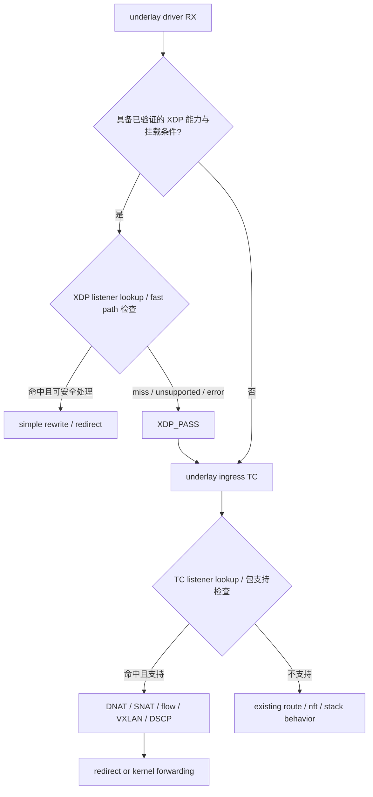
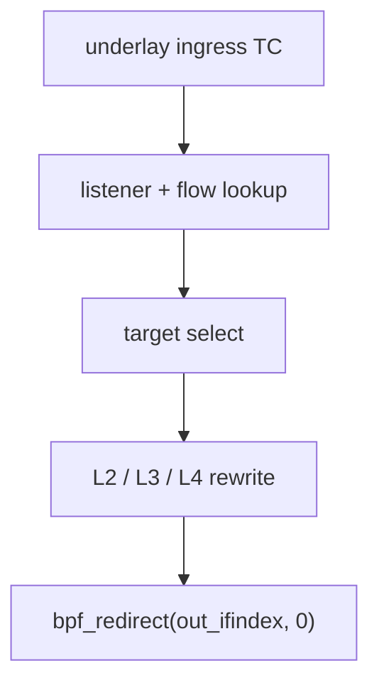
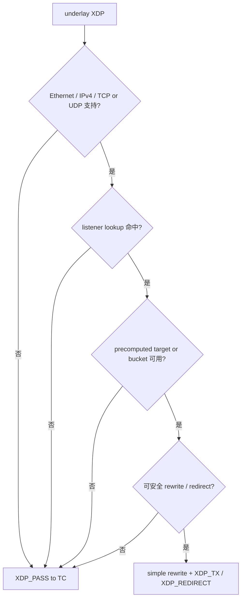
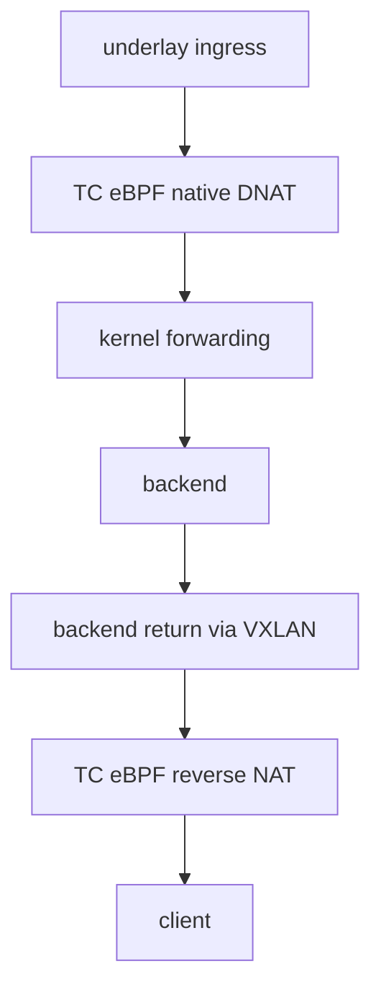

# edge-lb 转发性能优化方案评估

本文记录 gateway 转发路径的候选优化方案，用于后续设计评审和压测排序。当前实现的主要转发逻辑已经在 TC eBPF 中完成；以下方案均不代表已经实现或验证。

## 结论

若目标是继续提高 gateway 转发上限或降低转发延迟，优化方向应聚焦减少慢路径，例如 TC redirect fast path 或 XDP fast path。

基于“更早 hook、更少 stack”的优化路线应分层推进：先把当前 TC ingress
路径中仍依赖内核 route/nft/邻居慢路径的部分收敛为可回退的 TC direct
redirect；只有在 TC redirect 已验证仍不能满足目标，且目标云主机支持 native
XDP 时，再把 XDP 作为可选的 prefilter/fast path。TC 主路径仍应保留为权威
datapath，用于完整 NAT、VXLAN/DSCP return-path、flow persistence、HA、metrics
和 fallback。

## 方案比较

| 方案 | 延迟/吞吐潜力 | 复杂度 | 说明 |
| --- | --- | --- | --- |
| 当前 TC DNAT | 已经较高 | 中 | 当前主要转发逻辑已经在 eBPF，健康 target 通过 pinned map 原地增删，普通健康变化不重挂 TC 程序。 |
| TC eBPF + redirect 直接出设备 | 可能更高 | 高 | 收益来自绕过 route、nft 或部分内核转发路径；需要重新处理邻居解析、L2 目的 MAC、MTU、checksum、fallback 和 flow/HA 一致性。 |
| XDP native driver | 最高潜力 | 很高 | 更靠近网卡入口，理论上延迟最低、吞吐最高；但 NAT、VXLAN、flow state、HA sync、分片和错误处理都会显著复杂化。 |

## 更早 hook、更少 stack 方案

本轮 TC 正向、gateway 回程和 backend 回程优化在 `patch` 分支推进，完整实现并通过
功能、故障、HA 与性能回归后再合并 `master`。不增加配置、API、环境变量或编译 feature
来切换新旧路径。报文和拓扑满足条件时自动加速，其他情况保留必要的自动回退。

细化方案：

- [TC 正向 direct redirect](tc-direct-redirect-fast-path-plan.md)。
- [Gateway return path](gateway-return-path-optimization-plan.md)。
- [Backend 回程](backend-return-path-optimization-plan.md)。

XDP 仍为后续候选，不是本轮 `patch` 合并前必须实现的范围。

目标不是简单替换现有 TC DNAT，而是把数据面拆成“可命中 fast path”和“完整
main path”：

分层原则：

- TC 仍是默认启用路径和功能全集；XDP 只处理严格可证明安全的子集。
- fast path 只能减少路径长度，不能改变 listener、target group、健康状态、HA active
  gateway、VXLAN/DSCP return-path contract 的语义。
- 命中条件必须保守：IPv4、非分片、TCP/UDP、listener 存在、target 健康、邻居/L2
  信息可用、MTU/headroom 满足、checksum 可正确更新。
- 任何 fast path miss、map 不一致、邻居缺失、checksum 更新失败、分片或未知协议都
  必须回落到 TC main path 或内核慢路径。
- 所有架构变更需要先形成设计并同步确认，不能在实现中隐式改变 backend 对 xDS
  订阅、VXLAN、DSCP 的既有约束。

### Phase 0：基线与能力探测

在实现前先补齐可重复基线，避免把 backend 或压测机瓶颈误判为 gateway datapath：

- 记录当前 TC DNAT 的 TCP CPS、UDP RPS、PPS、p50/p95/p99、CPU、softirq、网卡
  drop/error、eBPF miss/error/fallback 计数。
- 单独记录 backend 服务 CPU、队列和 socket 错误，区分“gateway 转发上限”和
  “backend 服务或主机协议栈处理不过来”。
- 启动时探测 underlay 设备能力：是否支持 XDP native、是否只能 generic、是否存在外部
  XDP 程序、驱动名、MTU、offload 状态。
- 固定 `master` 基线提交，保存构建产物、commit 和二进制摘要；与 `patch` 各阶段
  提交构建进行对照，不使用运行期开关生成测试组。

验收：基线可重复，阶段构建可追溯；能力探测本身不改变 datapath。

### Phase 1：TC direct redirect PoC

第一阶段优先做 TC direct redirect，而不是直接上 XDP。它仍运行在 skb/TC 层，便于
复用现有 parser、map、stats 和 fallback，同时减少 route/nft/部分内核转发路径：

需要新增或验证：

- 邻居缓存：userspace 从 netlink 学习 target 下一跳 MAC、出口 ifindex、MTU，写入
  pinned map；过期或缺失时 TC 程序 fallback。
- L2 rewrite：更新目的 MAC、源 MAC、目标 underlay 地址、端口和 checksum。
- MTU/GSO/GRO 边界：只对可安全线性访问且长度满足的包启用 redirect；其他包 fallback。
- fallback metrics：按原因统计 `neighbor_miss`、`mtu_unsupported`、
  `checksum_error`、`fragment_unsupported`、`redirect_error`。
- flow 一致性：redirect 命中必须仍写入或命中 `NATIVE_FLOWS`，并与 HA xSync、
  flow persistence 使用同一套 key/value 语义。
- 健康状态：target 变为 unhealthy 后从可选集合移除；已有 flow 是否保留仍遵守当前
  flow preserve 语义，不因 redirect 路径另开规则。

PoC 范围：

- 单 VIP、单 listener、TCP/UDP、非分片、单 target。
- 后端为同一二层或可直接解析下一跳 MAC 的 underlay 路径。
- 不改变当前 VXLAN/DSCP return-path contract。

验收：

- 功能：TCP/UDP 手工请求、健康切换、HA 切主、flow persistence restore 均通过。
- 性能：与当前 TC DNAT 在同一机器、同一 backend、同一 ha-bench 参数下对比；至少
  记录 CPS/RPS、PPS、CPU/softirq、p99 和 fallback 比例。
- 安全回退：清空邻居 map、制造 MTU 不支持、切 target unhealthy 时，业务可回退且
  计数可观测。

### Phase 2：TC redirect 功能扩展

PoC 成立后再扩大覆盖面：

- 多 target、`hash`、`consistent_hash`、`rr`、`priority`、`persist`、`lc` 按现有语义
  复用同一 target 选择逻辑。
- 健康状态变化只更新 map，不重挂 TC 程序；redirect 和非 redirect 路径看到同一健康
  target 集合。
- 按独立文档完成 gateway return path 和 backend 回程优化，保持 VXLAN/DSCP contract：
  backend 不感知额外的 gateway UDP 服务端口或 active gateway 端口选择。
- 增加 per-listener fast path 命中率、fallback 原因、redirect 成功/失败、邻居状态
  digest 指标。
- 增加 UI/API 只读状态展示：fast path 能力与挂载状态、命中率、fallback top reason、
  XDP/native 能力探测结果。

验收：在现有高并发报告同等场景下，redirect 命中率稳定、fallback 可解释，且
`target_miss_total`、`return_miss_total`、checksum error、consistent-hash fallback
不出现异常增长。

### Phase 3：XDP optional fast path

只有满足以下条件才进入 XDP：

- 目标云主机确认支持 native XDP；generic XDP 不作为性能优化目标。
- TC redirect 已完成 A/B 数据，仍不能满足目标或确认瓶颈在 skb/TC 之前。
- XDP 仅作为能力满足时的早期命中层；TC main path 仍完整保留。

XDP 初始范围应更小：

约束：

- 不在第一版 XDP 实现完整 flow persistence、复杂 HA restore、分片处理或 ICMP 差错
  NAT。
- XDP map 由同一 userspace reconcile 写入，不能引入第二套配置语义。
- XDP 程序必须检测已有外部 XDP 程序，遵守现有 xdp-firewall 约束；不主动覆盖未知程序。
- XDP 命中率、pass 原因、redirect 失败、driver mode 必须暴露 metrics。

验收：native XDP 模式下，简单 UDP/TCP VIP 流量比 TC redirect 有可重复收益；XDP_PASS
报文由 TC 正确处理。若只能 generic XDP 或收益不稳定，则停止在 TC redirect
路线。

## 当前 TC DNAT

当前 gateway 入口主要路径已经是 TC eBPF：

健康状态变化时，gateway 原地刷新 pinned maps：

- `NATIVE_TARGETS` 只保留健康 target。
- `NATIVE_LISTENERS.weight_total` 随健康 target 重算。
- 普通健康变化不 detach/attach TC 程序。
- 已有 flow 优先命中 `NATIVE_FLOWS`，不会因为 target 健康抖动立即断开。

## TC redirect fast path

TC eBPF + redirect 的潜在收益来自更早地完成转发决策，并减少后续内核路径：

这条路径需要重新设计或验证：

- L2 目的 MAC 与邻居解析；
- MTU、GSO/GRO、分片边界；
- TCP/UDP checksum 更新；
- fallback 到内核慢路径的条件；
- flow map、HA xSync 与 redirect 路径的一致性；
- 与 VXLAN return path 的组合方式；
- 观测性、stats 和故障计数。

该方向可能带来 gateway 转发收益，但复杂度明显更高。

## XDP optional fast path

XDP native driver 的潜力最高，但也最容易扩大边界：

- NAT 和 reverse NAT 需要更早处理 L2/L3/L4；
- VXLAN、flow state、HA sync、健康目标切换都要重新对齐；
- 分片、ICMP 差错、MTU 和 fallback 更复杂；
- 不是所有云网卡或虚拟化环境都有同等 XDP driver 支持。

Cloudflare Unimog 的公开实现可作为 XDP L4LB 参考，但它依赖自建 edge 网络、可控硬件/驱动、
GUE 封装、一致 forwarding table 和独立控制面。该实现已单独整理在
[cloudflare-unimog-reference.md](cloudflare-unimog-reference.md)，不应直接视为 edge-lb
的默认迁移路线。

## 验证顺序

1. 建立基线：记录当前 TC DNAT 的 CPS、PPS、p50/p95/p99、CPU、softirq、drop、eBPF stats。
2. 定位瓶颈：区分 backend 应用处理、host 协议栈队列、gateway TC path、nft/route/VXLAN 路径。
3. TC redirect PoC：实现最小 TCP/UDP 单 VIP 单 target 路径，验证 L2、checksum、fallback 和 stats。
4. 扩展语义：再加入多 target、健康切换、flow preserve、HA sync、VXLAN return path。
5. 最后评估 XDP：仅当 TC redirect 仍无法满足目标，且复杂度可接受时推进。

## 与高并发压测的关系

2026-09-11 高并发测试中，timeout 随客户端阈值放宽而明显下降，TCP 在 3 秒和 5 秒阈值下均为 0 失败，UDP 仍有少量尾部 timeout。该现象更倾向于 backend 服务处理能力或主机协议栈队列压力，而不是固定 gateway 转发路径异常。

因此，本文的 fast path 方案应作为后续转发上限优化储备，不应替代 backend/host 队列瓶颈排查。
