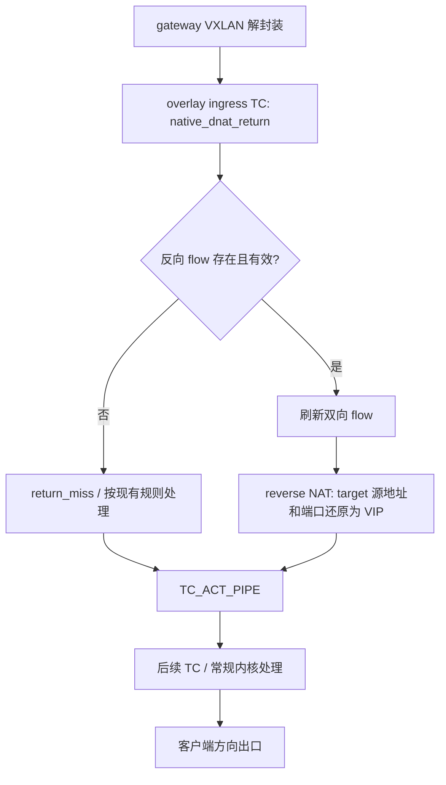
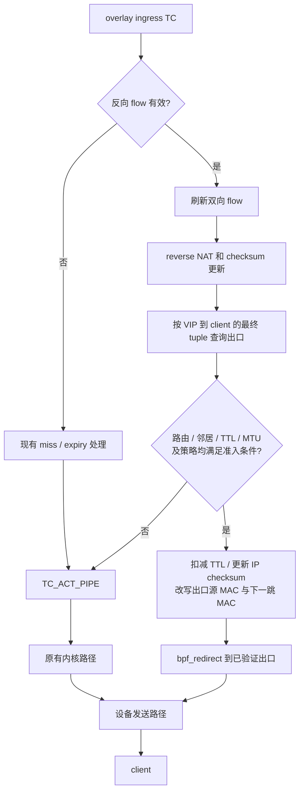
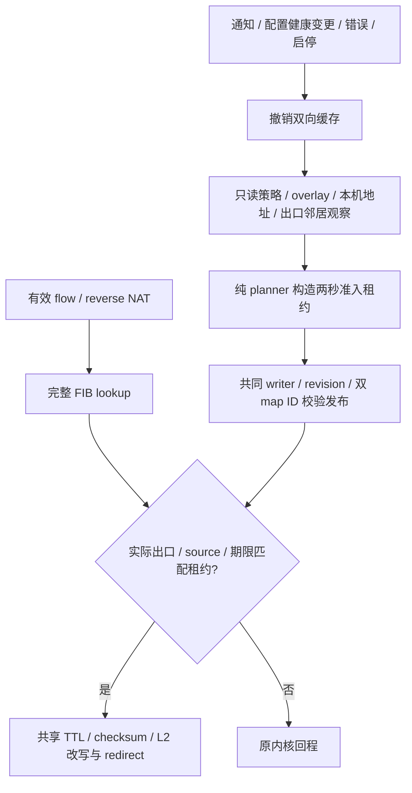

# Gateway return path 优化方案

## 状态与范围

本文设计 gateway 收到 VXLAN 回包之后的 TC direct redirect。`patch` 已接入 NAT 错误边界、
完整 FIB lookup、自动准入租约和回程 redirect；本地隔离拓扑收发及故障回归已通过。
尚未部署、完成生产主机自动准入验收、HA 联合回归或证明性能收益。
架构变更须先同步并得到确认。本文与
[正向 TC direct redirect](tc-direct-redirect-fast-path-plan.md)、
[backend 回程优化](backend-return-path-optimization-plan.md) 分别设计、验证，并在 `patch`
分支完成全部实现后合并 `master`。不增加运行期开关或构建 feature 来选择新旧路径。

完整回程分为两个优化位置：


本文只缩短 gateway 解封装后的转发路径。继续使用内核 VXLAN 解封装和现有
`native_dnat_return` hook，不迁移到物理网卡 XDP，也不改变 backend xDS contract。
backend 仍只订阅 VXLAN/DSCP，不接收业务端口或 active gateway 状态。

## 当前行为

`edge-lb-ebpf/src/main.rs` 的 `try_native_dnat_return` 当前依次执行：

1. 解析 Ethernet、IPv4、TCP/UDP；不支持的报文返回 `TC_ACT_PIPE`。
2. 按 backend 到 client 的报文 tuple 查询 `NATIVE_FLOWS`。
3. 检查过期；过期时清理双向 flow、活动计数和对应 flow 事件。
4. 刷新双向 flow 的 `last_seen_ns`。
5. 将 target 源 IP/端口还原成 VIP/监听端口，维护 checksum 和 UDP zero-checksum。
6. 更新 rewrite 统计；`patch` 继续尝试 FIB/租约校验，满足条件 redirect，其余 `TC_ACT_PIPE`。

NAT store/checksum helper 失败由共享 `nat.rs` 统一处理为 `TC_ACT_SHOT`，累计现有
`checksum_error`，不把部分修改的包交回内核；解析失败发生在改写前，仍可原样 `PIPE`。
这项前置修复同样适用于正向新流和已有流，没有修改 selector、flow ABI 或 backend contract。

以下为优化前的普通回程基线；`patch` 在 reverse NAT 后增加的分支见下一节。



`return_miss` 后交给内核不意味着业务成功：缺失反向 flow 时，本方案不凭路由推断 VIP，
也不重新运行一致性 hash 来重建反向 NAT。

## 目标与收益边界

有效回程 flow 完成反向 NAT 后，满足条件的包直接发往客户端方向出口。



收益来自减少解封装后的常规 IP forwarding、相关 netfilter hook 和内层邻居处理。
仍有 VXLAN 解封装、skb、flow 查询/刷新、反向 NAT、出口发送及可能的 qdisc/egress
处理，不应描述成绕过所有 TC、nft 或整个协议栈。

响应字节或包数明显大于请求时，回程可能是重要热点。但只能由同拓扑测试确认收益，
不能根据路径图承诺吞吐翻倍或固定延迟下降。

## 出口查询：首版采用内核 FIB

首版使用 TC 可用的 `bpf_fib_lookup()` 获取路由、出口和邻居信息，再执行 redirect。
不同时实现自建客户端路由缓存；它会引入额外失效、内存和一致性语义。

查询使用反向 NAT 后的源 VIP、目的 client IP、协议、端口、TOS、实际入口上下文及
内核接口要求的长度字段。必须核对 helper ABI 的字节序和内核支持情况。

关键要求：

- 默认使用完整 lookup，不能直接用 `BPF_FIB_LOOKUP_DIRECT` 绕过策略规则并假设等价。
- 即使完整 lookup，也不保证重放所有 `ip rule`、fwmark、VRF 或 netfilter 行为。
  首版只准入已验证等价的路由环境；依赖 helper 无法表达的规则时自动使用原有路径。
- 只有明确成功且目的为可转发的外部地址时才使用返回的 ifindex、源 MAC、下一跳 MAC。
  本地交付、不可达、blackhole、缺邻居等结果不进入 redirect。
- 客户端下一跳不能来自 `NATIVE_TARGET_ROUTES`：它是 backend 方向的信息。
- 不从旧请求的 Ethernet 头盲目学习客户端下一跳；跨网关、HA、路由变化时可能失效。
- 不固定出口为 `underlay_dev`；先查实际出口，再检查其是否属于已验证的支持范围。
  首版排除未验证的 VLAN、bond、VRF、二次隧道等组合。

FIB 查询有每包成本，因此预计收益主要是跳过其后的常规转发处理，而不是消除所有
路由查询。仅在测量证明该查询成为热点后，另行评审客户端路由缓存。

## 报文处理与回退边界

| 检查项 | 快速路径条件 / 处理 |
|---|---|
| flow | 有效反向 flow；继续沿用当前 expiry 和双向刷新规则 |
| 报文类型 | 首版 IPv4、非分片、TCP/UDP；不扩大现有 parser 支持范围 |
| TTL | 转发时恰好扣减一次并更新 IP checksum；TTL 小于等于 1 交给原有 ICMP 处理路径 |
| MTU | 按实际 L3 长度和出口 MTU 判断；不能把整个 Ethernet 帧长度直接与 IP MTU 比较 |
| offload | GSO/GRO、非线性 skb、partial checksum 仅在已验证组合中启用 |
| L2 | 出口设备源 MAC、客户端下一跳目的 MAC；不能保留 VXLAN 内层 MAC 当作外层下一跳 |
| 策略 | 被跳过的过滤、NAT、MSS、限速和后续 TC action 没有必需作用，或已证明等价 |
| 源地址 | 保持 flow 中的 VIP；不改变云网络对源地址、VIP 归属的限制 |

分为三个处理阶段：

1. 现有 reverse NAT 阶段完成并确认 checksum 正确。
2. 查询并判断是否适用 redirect。失败时保持原有 reverse NAT 结果，返回 `TC_ACT_PIPE`。
3. 决定 redirect 后才扣减 TTL、修改 L2 并提交发送。

第二阶段回退的报文应与现有 reverse NAT 后的报文一致，避免内核再次扣减已修改的 TTL。
第三阶段部分修改后失败，必须恢复或显式丢弃并计数，不得无条件返回 PIPE。
reverse NAT 本身部分修改失败也不属于“安全回退”，需在实现评审中检查当前错误分支。

提交 redirect 后，程序不能等待实际发送结果再恢复慢路径。因此提交计数与设备 drop、
业务成功率分别观测。neighbour miss 可回退让内核处理 ARP；BPF 不自行发送 ARP。

## Flow、HA 与健康状态

- 不改变 `NativeFlowKey`、`NativeFlowValue`、xSync 协议或 flow persistence snapshot。
- 已有 flow 仍沿用当前后端归属与健康变化时的 preserve 语义；不额外查询健康状态并
  因 target 已下线就丢弃已经收到的合法回包。
- 保持现有双向 flow 刷新。减少 map 写入属于另一个生命周期优化，不与 redirect 混入。
- 出口信息在本 gateway 查询，不把设备 ifindex/MAC 经 xSync 复制到 peer。
- VIP/HA 归属变化、恢复的 flow 和路由收敛必须联合测试。redirect 不自行把回包转给
  “当前 active gateway”，也不能绕过原有 VIP 源地址授权限制。
- 不支持的内核、helper 或 ABI 在 attach/启动阶段检测：保持已验证的现有程序，不以
  “运行时 map fallback”掩盖 verifier 无法加载整个程序的问题。

## 运行行为与观测

优化版本对满足条件的回包自动使用 redirect，不增加配置、API 或环境变量开关。
自动回退保留报文、路由和平台兼容能力，不构成第二套可选语义。

本阶段不新增客户端 route map，也不增加开关 map。
统计 ABI 与 pinned map 的大小必须显式迁移；结构体尾部追加字段也会改变 map value
size，不能直接认定与旧 map 兼容。

### 自动准入短租约

提出方案补充并收到继续实施指示后，本批采用独立内部 `NATIVE_RETURN_LEASES`。
它传递 userspace 观察过的策略上下文，不提供新旧路径选择，不属于产品运行期开关。
不能用正向 `NATIVE_TARGET_ROUTES` 给回程授权：target 下线后，已有 flow 的合法回包
仍沿用原语义，两个方向的出口不同。

| ABI | 内容 |
|---|---|
| map 类型/容量 | HashMap，16384 项 |
| key | `ReturnLeaseKey` 12 字节：overlay ingress ifindex、实际出口 ifindex、本机 source IPv4，均为主机序 |
| value | `ReturnLease` 8 字节：单调时钟 `expires_ns` |
| 独立统计 | `NATIVE_RETURN_STATS` per-CPU array，value 72 字节；不改已有 NAT/正向统计 ABI |

发布条件与生命周期：

- 回程入口必须是已启用、非 bridge/VRF 从属的原生 VXLAN；`accept_local=1`、forwarding
  开启、all/入口 rp_filter=0。沿用已实现的标准 IPv4 rule、netfilter/XFRM/LSM 保守准入。
- 出口枚举当前普通 Ethernet 设备，不固定 `underlay_dev`，排除 veth/VLAN/bond/VRF/
  二次隧道等未验证组合。拒绝 TOS/source FIB、multipath/未知路由属性以及外来 TC/TCX。
  overlay ingress 核验唯一 return 程序的 map ID、协议、priority、direct-action；出口检查
  egress TC/TCX。读取失败时不发布，不修改主机安全策略来强行通过。
- 来源只使用当前本机 IPv4 Local 地址，排除特殊地址；不包含广播地址，不扫描 flow map。
  回包还必须先命中有效 reverse flow。旧 listener 已移除但 VIP 仍在本机时不破坏 flow preserve。
- FIB helper 接受的邻居状态比租约准入宽。任一出口存在非 REACHABLE/PERMANENT 的 IPv4
  邻居时，撤销该出口的所有租约，让内核 NUD/ARP 恢复；会牺牲部分无关客户端的加速命中率，
  但不创建客户端邻居缓存或主动发 ARP。
- 与正向共享 writer/revision，快照同时记录两个 map ID。健康/配置变化、内核通知、重连、
  启停和发布失败清理两个方向；失效前快照和重复 token 不可复用。目标健康变化只触发
  回程短暂回退，后续租约观察不依赖 target 集合。
- 租约从观察开始计算 2 秒，复用 500ms 刷新门槛和 200ms 事件轮询。不是内核原子事务：
  地址、策略、邻居状态变化仍有通知/刷新窗口，不能称零窗口；FIB 每包反映当前路由，但
  不能消除准入快照的陈旧窗口。任一方向观察失败，本批保守撤销双向加速。
- `bpf_fib_lookup` flags 固定为 0；IPv4 地址/端口为网络序，`tot_len` 为主机序；入口取
  当前 hook 的 `skb.ifindex`，不是可能保留外层接口的 `ingress_ifindex`。MTU 由 helper 检查，
  只接受成功且出口、source、期限匹配租约及合法 L2 的结果。
- 查询发生在租约 key 的实际出口已知之前，所以无租约时也可能执行 FIB，再回退普通路径；
  这部分开销必须纳入后续混合路径压测，不能只测命中场景宣称净收益。

FIB 参数、成功/邻居/MTU 返回及 NUD_VALID 行为依据
[Linux FIB helper 实现](https://github.com/torvalds/linux/blob/v6.12/net/core/filter.c)，
实际 helper 可用性由部署内核 verifier 决定。



独立 map 随 native 对象统一 pin/unpin，owned map 数从 11 增加到 13；flow ABI、xSync、
持久化和 backend xDS 不变。替换前先加载、验证新对象的两个 TC 程序；helper/verifier
失败不先删除旧程序或 pin。此预检不等于 attach/pin 后续失败具备完整事务回滚。

沿用 gateway-only metrics 端口和白名单，已接入：

- `edge_lb_gateway_native_return_redirect_submitted_total`：提交次数，不代表投递成功。
- `edge_lb_gateway_native_return_redirect_fallback_total{reason}`：原因使用有限枚举，
  包括 route、neighbor、ttl、mtu、unsupported、policy、expired。
- `edge_lb_gateway_native_return_redirect_mutation_error_total`：改写或提交阶段错误。
- `edge_lb_gateway_native_return_redirect_stats_available`：统计是否可读；不可读不伪造零计数。

不在指标标签放客户端 IP、端口或 flow ID，避免高基数。复用现有 return miss 和
checksum error 指标，另检查设备 TX/drop、TCP 重传及端到端业务成功率。

## 验证计划

### 已新增的前置回归

`linux::redirect::return_kernel_tests` 加载当前 eBPF 对象，通过 `BPF_PROG_TEST_RUN`
验证原 reverse NAT 路径。构包、独立 checksum 计算和执行工具放在
`packet_test_support.rs`，由正向和回程测试复用，不复制一套 NAT 实现作为判断依据。

- TCP、UDP 和 UDP zero-checksum，多个 VIP/端口；只改源地址/源端口及相关 checksum，
  L2、TTL、DSCP/ECN 保持不变。
- 没有 listener/target map 条目时，已恢复/已存在的 flow 仍可回包，并同步刷新双向时间戳。
  这里是直接预置真实 flow map，不代替 SQLite snapshot restore 或 HA xSync 端到端验证。
- TTL=1 及 IPv4 options 在 reverse NAT 后交回内核处理，不提前递减 TTL。
- flow miss、分片、非 IPv4 和截断 L4 头不改包、不刷新 flow；过期 flow 清理双向条目、
  active 计数，并输出两条删除事件。

测试不通过产品运行期开关注入 helper 失败，也未覆盖内核内存分配失败等罕见故障；
`SHOT` 错误分支仍需补充可控的 helper 故障注入。正常路径字节码测试不能替代该覆盖。
以上均不是回程 FIB redirect、完整主机准入或性能提升的证据。

### 回程 FIB 与真实收发回归

隔离拓扑复用 [第五批测试拓扑](forwarding-optimization-implementation-plan.md#第五批验证2026-09-16)。
新增 `kernel_network_tests/return_tests.rs` 执行 TCP/UDP 实际收发，并在该真实 FIB 上用
`return_packets.rs` 的 test-run 独立比较字节。测试显式授权 veth fixture，不放宽生产设备
准入；backend 仍使用单 VXLAN 静态回程，不代替双 gateway DSCP 选择或 HA 验收。

- TCP/UDP 正常回包的 submitted 增长；同一连接可在无租约、有效租约及过期状态间继续通信。
- 真实 ARP 恢复后可再次加速；客户经 `198.51.100.3` 下一跳转发成功，不要求二层直连。
- 目标从 map 删除，旧 flow 仍可 reverse NAT；重新发布回程租约无需恢复 target。
- 真实 FIB 上 UDP/zero-checksum 的 VIP 源地址、监听源端口、TTL、MAC 和 checksum 字节
  与独立计算结果一致。TTL=1、超过出口 MTU、blackhole 和未准入出口均 `PIPE`，不额外改 TTL/L2。
- 错误 priority、错误 map ID、外来 return ingress 程序不获 TC 准入；双 map 发布失效、
  重复 token、过期、map 替换和失败清理均独立验证。

内核测试的黑洞路由和未准入出口只用于 test-run，不发送业务包；它们回退并不意味着
该路由下业务能成功。实机完整自动准入、网卡 offload 组合、HA/flow restore 与性能仍待验收。

### 功能与故障

覆盖 TCP、UDP、zero-checksum、直连和经默认网关客户端、多 VIP/端口、正向各 selector、
目标健康变化、邻居过期、路由变化、flow expiry、flow restore、HA 切换、TTL=1、
MTU/分片、GSO/GRO、partial checksum、策略路由及现有外部 TC 程序。

排除的策略和报文必须验证不会误进入快速路径。自动回退或 miss 仅表示保持现有处理，
不代表原本无法 reverse NAT 的包也能成功。

下面是计划命令，不是已执行证据；尖括号字段用测试环境替换，报告不得包含公网地址。

```bash
ip -d link show <overlay-dev>
ip rule show
ip route get <client-ip> from <vip> iif <overlay-dev>
ip neigh show dev <client-out-dev>
sudo tc -s filter show dev <overlay-dev> ingress
sudo tc -s filter show dev <client-out-dev> egress
sudo nft list ruleset
sudo ethtool -k <client-out-dev>
sudo tcpdump -ni <overlay-dev> -nn 'host <client-ip> and port <service-port>'
sudo tcpdump -ni <client-out-dev> -nn 'host <client-ip> and port <service-port>'
curl -H 'Authorization: Bearer <token>' http://<gateway-underlay>:18080/api/v1/status
curl http://<gateway-underlay>:<metrics-port>/metrics
```

route 查询按实际环境补充 mark、TOS 等参数；命令成功不等于 helper 行为等价，需对照
真实包的出口、源地址、TTL、checksum 和路由变化结果。metrics 从白名单允许的位置访问。

测试机基础 TCP/UDP 探测：

```bash
printf 'discover\n' | nc -N -w 5 <vip> <service-port>
(printf 'discover\n'; sleep 1) | nc -u -w 5 <vip> <service-port>
```

### 性能隔离

先固定 backend 使用现有回程，按提交构建对照，不靠运行期开关产生测试组：

| 组别 | 构建来源 | 用途 |
|---|---|---|
| A | 固定的 `master` 基线提交 | 现有转发基线 |
| B | `patch` 正向优化完成时的提交 | 正向增量收益 |
| C | `patch` 正向与 gateway 回程优化完成时的提交 | B/C 对比评估回程增量，A/C 评估双向整体收益 |

各阶段产物记录 commit 和二进制摘要；中间提交仅用于验证，不提前合并 `master`。

同样的 `ha-bench` 版本、算法、源端口样本、并发、duration、timeout 和 payload，每组至少
三轮并交替顺序。分别测试小包高 PPS、请求响应相近、响应较大的业务模型；工具不支持
的响应模型需先补充受控测试服务，不能把请求数代替回程吞吐。

记录成功率、CPS/RPS、PPS、吞吐、p50/p95/p99、CPU/softirq、设备 drop、重传、return miss、
redirect 提交率和回退原因。报告保留完整命令、内核/offload、服务器配置和 CPU 频率。

backend 优化在其独立测试通过后再加入联合对照，不能同时改变两端并把总收益归因于
gateway return redirect。

## 实施与回滚

1. 采集当前 gateway 回程基线与策略依赖，确认候选出口和内核能力。
2. 冻结准入、FIB 参数、错误处理和统计 ABI，完成架构确认。
3. 验证 FIB 查询结果与当前路由一致，再接入现有 reverse NAT 后的 redirect 分支。
4. 完成功能和故障测试，尤其部分改写失败、TTL 和 checksum/offload。
5. 完成阶段提交的性能对照和两端完整回归，收益超过波动且无成功率回退后再合并 `master`。

回滚恢复已验证的基线构建，保留原有 flow map 和 TC reverse NAT。回退二进制或统计
map ABI 时按明确的 map 迁移/程序替换步骤执行；不清空业务 flow、xSync 或 backend
学习状态来掩盖兼容问题。

## 重载验证边界

第十二批在隔离 VXLAN 拓扑验证 map 重建、flow 回填、旧租约失效和新授权后恢复
redirect，原 TCP/UDP socket 可继续使用；前提是先等待测试中的 delayed ACK 排空。
另一个用例明确在卸载 TC NAT 的窗口发送 TCP，复现本机 VIP 协议栈导致连接中断。
这是非原子卸载/挂载窗口的风险记录，不能用成功回填 flow 来推导热重启无损。
未实现 map 保留/原子程序替换等新的生命周期架构，变更前仍须确认。
完整范围与四机部署前状态见 [部署前验证记录](patch-rollout-validation-2026-09-16.md)。

## 参考

- [Backend 回程优化方案](backend-return-path-optimization-plan.md)。
- [现有 VXLAN/DSCP 回程](vxlan-dscp-verified.md)。
- [Linux BPF helper 文档](https://kernel.googlesource.com/pub/scm/docs/man-pages/man-pages/+/refs/tags/man-pages-6.13/man/man7/bpf-helpers.7)：
  `bpf_fib_lookup`、`bpf_redirect` 的行为和返回值；部署内核能力仍需验证。
