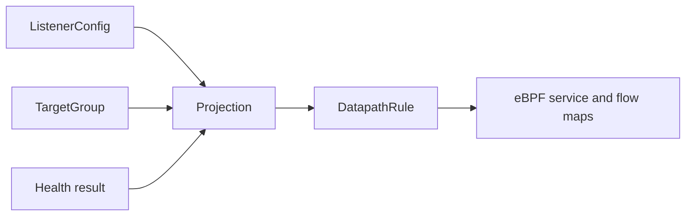

# 监听配置与目标组模型

## 设计目标

edge-lb 的管理 API 和配置文件使用自己的资源模型，不复刻任何外部负载均衡器的 LB、独立后端目标资源或 service 结构。业务配置只有监听配置和目标组；数据面规则是运行时投影，不能反向成为管理配置。

## 目标组

目标组是后端资源的最小管理单位，负责后端成员、权重和健康探测。

```text
TargetGroup {
  name: string                 # 必填，唯一
  targets: BackendTarget[]     # 可为空；自动配置尚未匹配节点时保留目标组
  monitor: bool                # false 表示关闭探测
}

BackendTarget {
  address: IPv4                # 后端 VXLAN 节点 underlay IP
  weight: u32                  # 1..=65535
}

HealthCheck {
  type: ping | tcp | udp | http | https
  port: u16                    # 探测端口，不是转发端口
  request: string?             # tcp/udp 为探测请求，http/https 为路径
  response: string?            # 可选响应匹配
  interval_secs: u32           # 默认 15
  retries: u32                 # 默认 3
  skip_tls_verify: bool        # 仅 https
}
```

`monitor = false` 时，不创建探测任务，也不生成独立后端目标资源。探测结果只作为目标组运行时视图的一部分返回，例如 `targets[].health`，不能由客户端提交。目标组允许为空，以便自动配置先创建目标组、后随节点发现收敛目标成员。

实现上健康检查字段仍与目标组平铺存储（`probe_type`、`probe_port`、
`probe_req`、`probe_resp`、`period_secs`、`retries` 和
`probe_skip_tls_verify`）；上面的 `HealthCheck` 仅表示语义分组，不是额外
的 JSON/TOML 嵌套对象。

## 监听配置

监听配置只描述入口、转发端口和目标组绑定，不包含后端目标列表。

```text
ListenerConfig {
  name: string                 # 唯一；自动规则为 tcp-80、tcp-udp-80
  vip_ips: IPv4[]              # 为空时使用本机 underlay IP，并按 HA 规则追加 VIP
  listen_port: u16             # 客户端访问端口
  target_port: u16             # 转发到目标组成员的端口
  protocols: ProtocolSet       # tcp、udp 或 tcp+udp
  target_group: string         # 必须引用已存在目标组
  scheduler: rr | hash | consistent_hash | priority | persist | lc
  idle_timeout_secs: u32       # 默认 60
}
```

TCP+UDP 是一个资源、一个名称和一行 UI 展示，但数据面会投影成两条内部协议规则。修改监听端口或目标端口时，只修改监听配置，不修改目标组。

`hash` 保留现有语义：使用内核 `skb` hash 对目标槽位取模，不改成一致性 hash。SIP 等要求重启后按同一流身份稳定回原后端的场景应使用独立的 `consistent_hash` 策略；该策略按客户端 IP、客户端源端口、监听端口和协议计算流身份，故意不包含 VIP，并在健康目标集合内通过 1024 个预计算一致性桶选择目标。bucket score 使用 64-bit 整数混合；gateway metrics 暴露实际 pinned bucket table digest 和 bucket hit/miss/unusable/fallback 计数。

转发模式固定为 `default`，不进入管理模型。该模式保留客户端源 IP，后端回程通过 DSCP 对应的 VXLAN 回到 active gateway，再由 gateway 执行反向 NAT。

## API 边界

- `GET/POST /api/v1/target-groups`
- `GET/PUT/DELETE /api/v1/target-groups/{name}`
- `GET/POST /api/v1/listener-configs`
- `GET/PUT/DELETE /api/v1/listener-configs/{name}`
- `GET /api/v1/target-groups` 返回目标成员和健康结果
- `GET /api/v1/listener-configs` 只返回监听字段和 `target_group`

监听 API 请求和响应中不得出现外部 provider wrapper 字段。`target_port` 是 edge-lb 自己的监听字段；目标组只使用健康探测的 `probe_port`，不保存转发端口。

内部数据面可以使用 target/slot/flow 等派生结构，但这些结构不是管理 API，也不能
反向写回为目标组或监听配置。

## 数据面投影



投影阶段把 `listener.target_port` 与目标组的 `address/weight` 合并，过滤不健康目标后生成内部规则。内部结构可以包含 flow key、backend port、状态和统计字段，但不能被 HTTP API 或配置文件复用。

## 校验与一致性

1. 目标组名称唯一，监听引用必须存在。
2. 目标地址必须是已注册 VXLAN backend 的 underlay IP，目标地址不可重复。
3. 监听端口、目标端口和探测端口都必须在 `1..=65535`。
4. 同一监听的协议集合去重；TCP+UDP 只保存一条配置。
5. 只有目标组绑定到至少一个监听后才运行健康探测。
6. 目标组或监听修改必须以一次配置事务更新内存、持久化状态和 eBPF 投影。
7. HA 复制只复制上述两个管理资源，BACKUP 不直接写数据面。
