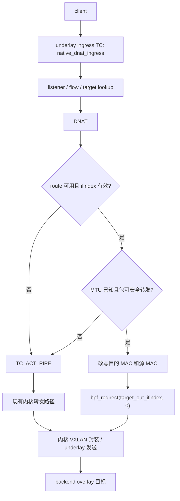
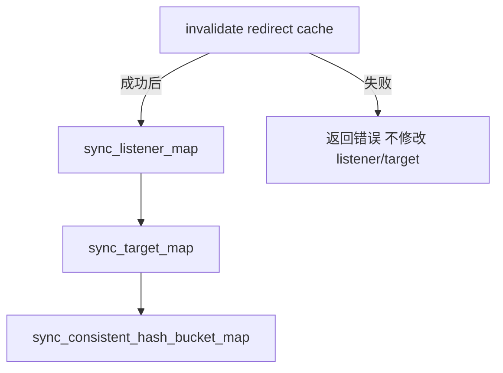
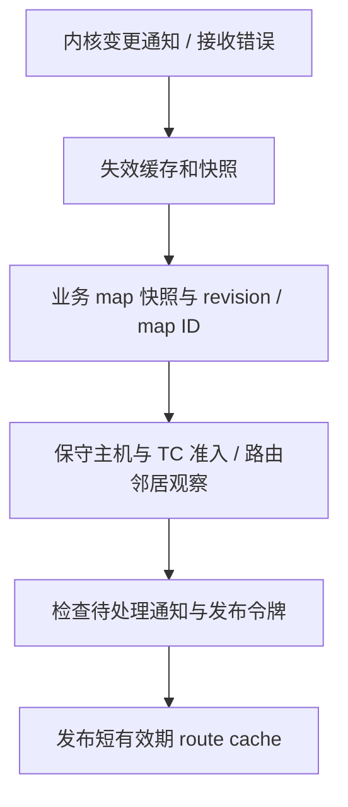

# TC direct redirect fast path 设计方案

本文细化 gateway native DNAT 的 TC direct redirect fast path。目标是在保持现有
listener、target group、健康状态、flow map、HA xSync、flow persistence 和
VXLAN/DSCP return-path contract 语义不变的前提下，减少 forward path 对内核
route/nft/部分协议栈转发路径的依赖。

该方案只覆盖 TC direct redirect，不讨论其他数据面方案。

实施优先级和进度见 [实施计划](forwarding-optimization-implementation-plan.md)。
代码核实：受管理 backend 的 target 通常是 overlay 地址，出口应保留为 VXLAN 设备，
由内核封装后经 underlay 发送。以下 redirect 的出口不能固定为物理网卡。

## 当前路径

当前 gateway native datapath：


已有能力：

- `NATIVE_LISTENERS`：按 VIP、端口、协议查 listener。
- `NATIVE_TARGETS`：按 listener/target slot 查健康且可选的 target。
- `NATIVE_CHASH_BUCKETS`：`consistent_hash` 的预计算桶表。
- `NATIVE_FLOWS`：正反向 flow entry，容量当前为 `1048576`。
- `NATIVE_ACTIVE_FLOWS`：least-connections 的活动 flow 计数。
- `NATIVE_FLOW_EVENTS`：flow upsert/delete ring buffer，用于 HA xSync。
- `NATIVE_STATS`：listener hit/miss、return miss、target miss、rewrite、checksum 和
  consistent-hash fallback 统计。

## 目标

新增内建的 TC direct redirect fast path，满足条件时自动使用：



收益来自：

- 在 TC ingress 完成 DNAT 后直接选择出口设备；
- 避免已命中 listener/target 的包继续依赖常规 route/nft/部分 forwarding path；
- 将邻居解析结果预先下发到 BPF map，减少 per-packet 慢路径工作；
- 保留当前 TC parser、selector、flow map 和 metrics，降低实现风险。

非目标：

- 不改变 backend xDS contract。backend 仍只接收 VXLAN/DSCP return-path 数据面配置。
- 不让 backend 感知 listener 端口、active gateway 或 redirect 细节。
- 不处理 IPv4 分片、ICMP error NAT、IPv6、非 TCP/UDP。
- 不把 XDP 作为本阶段交付内容。
- 不改变已有 selector 语义，尤其 `hash` 和 `consistent_hash` 必须保持当前定义。

## 分支交付与运行行为

本次性能优化在 `patch` 分支实现，完整实现并通过功能、故障、HA 和性能验证后再合并
`master`。不增加用户配置、API、环境变量或编译 feature 来切换新旧转发实现。

- 满足条件的包自动 redirect；其他包沿用 `TC_ACT_PIPE`，保持单一转发语义。
- 自动回退由报文、路由、邻居和平台能力决定，不是人工选择的运行模式。
- 普通健康和邻居变化只更新 map，不重挂 TC 程序。
- 性能对照使用固定的 `master` 基线提交和 `patch` 实现提交构建的产物。

建议在 API/metrics 中暴露只读状态：

- attached；
- map_digest；
- fast path hit ratio；
- top fallback reason。

## BPF ABI 设计

### 新增 map：`NATIVE_TARGET_ROUTES`

`HashMap<NativeTargetKey, NativeTargetRoute>`，容量 16384，复用已有 target key。

key：

```rust
#[repr(C)]
pub struct NativeTargetKey {
    pub listener_id: u32,
    pub target_id: u32,
}
```

value：

```rust
#[repr(C)]
pub struct NativeTargetRoute {
    pub expires_ns: u64,
    pub target: u32,
    pub ingress_ifindex: u32,
    pub ifindex: u32,
    pub mtu: u32,
    pub target_port: u16,
    pub dscp: u8,
    pub _pad: u8,
    pub source_mac: [u8; 6],
    pub destination_mac: [u8; 6],
}
```

字段语义：

- `ifindex`：redirect 出口设备。
- `mtu`：出口 MTU。为 0 表示未知，必须 fallback。
- `expires_ns`：本机 monotonic 有效期；过期回退，不能跨主机同步该时间值。
- `target` / `target_port`：host-order 实际 DNAT 目标，防止 slot 复用污染已有 flow。
- `ingress_ifindex` / `dscp`：限定已批准的入口和标记，不能将路由快照用于任意流量。
- `destination_mac`：下一跳 MAC。目标同网段时是 target MAC；经网关时是 next-hop MAC。
- `source_mac`：出口设备 MAC。value 大小为 40 字节，无隐式 padding。

map 更新原则：

- 与 `NATIVE_TARGETS` 一起按 listener/target slot 同步。
- target unhealthy 或 weight 变 0 时，从 `NATIVE_TARGETS` 和 `NATIVE_TARGET_ROUTES`
  同时移除。
- route 信息缺失时不写 route value，eBPF 会 fallback。

### 独立 stats

新增 `NATIVE_REDIRECT_STATS` PerCpuArray，保留原 `NativeDatapathStats` ABI 不变。
`NativeRedirectStats` 为 72 字节：

```rust
pub submitted: u64,
pub route_miss: u64,
pub route_invalid: u64,
pub expired: u64,
pub target_changed: u64,
pub ttl: u64,
pub mtu: u64,
pub unsupported: u64,
pub mutation_error: u64,
```

`submitted` 只表示 helper 返回 redirect 动作，不表示设备发送或业务交付成功。
`route_miss` 不等于 neighbor miss；缺少准入或尚未收敛也会导致缺项。
Prometheus 已接通独立 map 采集，指标与不可读语义见 [指标说明](metrics.md)。
自动收敛已接通，指标存在仍不代表该主机准入通过或业务投递成功。

### 本机源地址保护

新增 `NATIVE_LOCAL_ADDRS: HashMap<u32, u32>`，容量 4096，key 为与报文解析相同的
IPv4 数值，value 为 1。发布 route 前先写入本机地址和广播地址；整个 BPF 对象生命周期
只增加保护项，不删除旧地址，避免已取旧 route 的报文与地址更新竞态。满表使本轮发布
失败并清空 route。特殊源地址、本机/广播源地址回退内核；不改变 flow ABI 或持久化内容。

### L3 支持边界

- 跨网段、经过路由器的 IPv4 单播在设计范围内，不要求 target 与 gateway 二层直连。
  route lookup 返回 gateway 时，使用该 gateway 在出接口上的邻居 MAC，而非远端 target MAC。
- 当前核心仍要求 Ethernet 帧和可解析的出口 MAC；这不等于支持 TUN 等没有以太网头的
  纯 L3 设备。未支持的设备回退原路径。
- redirect 自行递减 IPv4 TTL 一次并更新 header checksum。TTL <= 1 或超过有效 L3 MTU
  时，在修改 TTL/L2 之前回退，让内核处理 ICMP、分片等语义。
- 受管理 backend 的目标仍为 overlay 地址，出口仍为 VXLAN；outer underlay 可以跨 L3，
  封装和外层路由由内核负责，不能直接用 backend underlay 替代内层目标。
- 源地址/mark/端口策略路由、ECMP 或后续 TC/netfilter 依赖，未经准入证明不写入 route map。
  目的地址查询成功不能单独证明这些场景可以加速。
- 已有下一跳解析单测、隔离 namespace 的真实 L3/VXLAN 路由和 ECMP/rule 测试，以及
  字节码 TTL/checksum 测试。隔离三 namespace 的 TCP/UDP 实际收发也已覆盖下一跳不同于
  target 的 VXLAN 路径、TTL/DSCP/ECN 和回退；该测试显式授权缓存发布，不代替生产主机
  完整自动准入、双 gateway 故障切换或实机性能验证。

## userspace reconcile

### route/neighbor 采集

gateway reconcile 需要为每个 active target 解析出口信息：

1. 用 netlink route lookup 查询 DNAT 的实际 target IP 的出口 ifindex、preferred source、
   gateway/next-hop。受管理 backend 使用 overlay 地址，不以探测用 underlay IP 替代。
2. 查询出口设备 MAC 和 MTU。
3. 查询 neighbor table：
   - 如果 route 有 next-hop，查 next-hop MAC；
   - 如果 route 是 on-link，查 target IP 的 MAC。
4. 诊断允许展示 `STALE`、`DELAY`、`PROBE` 的解析信息，但只对 `REACHABLE`、
   `PERMANENT` 发布/续租。`FAILED`、`INCOMPLETE` 等同样不写入 fast path map。

若 neighbor 缺失：

- 不在 BPF 中主动发 ARP；
- userspace 不主动修改邻居或发 ping；回退报文由内核完成邻居解析/NUD；
- 本轮 map 不写 route entry，eBPF fallback。

### map 同步

当前已接入失效的配置更新路径：



自动生产者已经按以下依赖接入；不能仅在 target sync 之后直接写入一次路由观察结果：



一致性要求：

- `NATIVE_TARGET_ROUTES` 的 key 集合必须是 `NATIVE_TARGETS` 的子集。
- health refresh 先失效缓存，再更新目标，整个修改过程持有共同 writer 锁。
  自动生产者只读取已绑定 listener、active 且 weight > 0 的实际 target map 条目；
  发布时验证 revision 和 pinned map ID，一次性消费令牌，不允许失效前的快照重新写回。
- route map 更新失败不能继续使用不可信的旧路由；应使受影响条目失效，让报文自动
  回退。若失效操作本身失败，必须报告收敛失败，不能声称已安全回退。
- 任何 attach ABI mismatch 时允许重挂 TC 程序，但普通健康状态、neighbor 状态变化不重挂。

### 自动准入范围与时间窗口

- 原生 netlink/procfs/securityfs 查询，不依赖 `ip`、`nft` 子进程。不接受部分读取或
  未知结果；超时、断流、重连、配置变化、写 map 失败都撤销缓存。
- 只接受标准 local/main/default IPv4 rule；拒绝源地址/TOS FIB 条目、ECMP、未知 nexthop。
  入口须为普通 Ethernet，出口可为 Ethernet 或原生 VXLAN，桥接/VRF 从属设备不准入。
- 任意 nft table（包括空表或无关表）、已加载的 legacy table、XFRM policy 或任一方向
  XFRM default 非 ACCEPT 均回退。本版不尝试证明任意规则集与业务无关。
- 全局与入口 forwarding 必须开启；all/入口 rp_filter 必须为 0。LSM 清单不可读或含未
  支持模块均回退；当前允许 capability、landlock、lockdown、yama、integrity、apparmor。
  例如含 bpf/selinux/smack 的主机本版不准入；不能为加速关闭主机安全策略。
- 入口仅允许本对象拥有的 DSCP marker 和 native ingress 程序，核验 map ID、priority、
  direct-action、协议和软件执行；存在外来 filter、其他 chain 或出口 egress filter 时回退。
  入口/出口还单独查询 TCX；有 TCX 程序就回退。仅在内核早于 6.6 且查询返回 EINVAL 时
  识别为该能力不支持，权限失败或新内核查询异常不能解释为空集合。
- 刷新门槛 500ms，通知轮询上限 200ms；查询/调度耗时使实际周期可能更长。每次 route
  租约固定为观察开始后的 2 秒，慢查询不延长租约；超过截止时间不发布。
- 当前发布先清空 route 再填充，本轮期间可短暂走普通路径，不改变会话。工作线程和 map
  发布均不与内核策略变更原子同步；legacy/sysctl/TCX 没有完整通知覆盖，陈旧状态仍可能被
  使用至租约过期（已取条目的在途包除外），不能称为零窗口安全保证。
- 分层内核验证已覆盖策略观察、TC 所有权、发布 fencing、字节码和显式发布缓存后的
  VXLAN/L3 实际收发。测试断言 veth 入口仍被 `check_host` 拒绝，不为测试放宽生产准入。
  完整自动准入成功后的实机收发、HA 与性能验证仍待完成，route digest 仍是后续诊断项。

内核格式依据：[XFRM 默认策略回复](https://github.com/torvalds/linux/blob/v6.12/net/xfrm/xfrm_user.c)
包含 in/fwd/out 三个字段及 netlink 对齐；[TC dump](https://github.com/torvalds/linux/blob/v6.12/net/sched/cls_api.c)
同时返回分类器摘要和实际 filter，两者不能当作四个独立程序。
[Linux 6.6 BPF query 分派](https://github.com/torvalds/linux/blob/v6.6/kernel/bpf/syscall.c)
包含独立的 TCX ingress/egress 查询，不以传统 TC filter 查询代替。

### digest

计算 target route digest，用于双 gateway 对照和排障：

```text
listener_id, target_id, target, target_port, ingress_ifindex, ifindex, mtu, dscp, destination_mac, source_mac
```

digest 只用于观测，不参与转发决策；有效期不参与稳定 digest。

## eBPF forward path

现有 `native_dnat_ingress` 在完成 rewrite 后返回 `TC_ACT_PIPE`。接入 redirect 后，
新增步骤只发生在 DNAT 成功之后。

伪代码：

```text
parse ethernet / ipv4 / tcp|udp
if unsupported:
  PIPE

flow_key = original client -> VIP tuple
if existing non-expired flow:
  target = flow.target / flow.target_port
  rewrite dst IP/port
  try_redirect(existing.listener_id, existing.target_id)
  PIPE on fallback

listener = NATIVE_LISTENERS[vip, port, proto]
target_id = select_target(...)
target = NATIVE_TARGETS[listener_id, target_id]
insert forward and reverse flow entries
rewrite dst IP/port
try_redirect(listener_id, target_id)
PIPE on fallback
```

`try_redirect`：

```text
route = NATIVE_TARGET_ROUTES[listener_id, target_id]
if missing:
  bump route_miss
  PIPE

validate lease / target binding / ingress / DSCP / Ethernet MACs
validate IPv4 header / checksum / TTL / L3 MTU / skb offload state
if any check fails:
  bump corresponding fallback counter
  PIPE

decrement TTL once and update IPv4 checksum
store eth.dst = route.destination_mac
store eth.src = route.source_mac
if mutation fails:
  bump mutation_error
  SHOT
action = bpf_redirect(route.ifindex, 0)
if action != REDIRECT:
  bump mutation_error
  SHOT
bump submitted
return action
```

注意：

- DNAT 的 IP 和 L4 checksum 由共享 `nat::Rewrite::destination` 负责；redirect 另更新 TTL 的 IP checksum。
- Ethernet header rewrite 不影响 IP checksum。
- UDP zero checksum 继续遵守当前逻辑：原来为 0 的 UDP checksum rewrite 后恢复 0。
- 分片已由 `ipv4_l4_supported` fallback，本阶段不扩大支持范围。
- GSO skb 仍回退：`gso_segs > 1` 或 `gso_size != 0` 不进入 redirect；但不能仅因 payload
  非线性就拒绝普通 TCP 包。报文读写使用 skb helper，不直接解引用 payload，也不主动拉平
  整包；保留 IP 长度与 skb 长度一致检查，修改失败仍按上述 `SHOT` 语义处理。

依据 [Linux skb helper 实现](https://github.com/torvalds/linux/blob/v6.12/net/core/filter.c)：
`bpf_skb_load_bytes` 使用 `skb_header_pointer` 读取，`bpf_skb_store_bytes` 通过
`bpf_try_make_writable(offset + len)` 准备修改范围，不要求整个 payload 事先线性存放。
真实 TCP 测试曾暴露整包线性检查导致小包无法加速的问题；移除该额外限制后，小包 redirect
及大块 TCP 的 offload 回退均通过，未放宽 GSO 准入。

## return path

正向 P1 阶段不改 return path；后续 P2 已在 `patch` 接入独立 FIB/准入租约回程，
详见下方回程文档。两者共享 TTL/L2 发送改写，不共享目标路由缓存作为授权。

理由：

- 当前回程依赖 VXLAN/DSCP contract，backend 不应感知 redirect fast path。
- `native_dnat_return` 已在 overlay ingress 做 reverse NAT，并更新同一 `NATIVE_FLOWS`。
- 先优化 client -> backend forward path，降低变更面。

回程分别设计与验收：

- [Gateway return path 优化](gateway-return-path-optimization-plan.md)：解封装后的
  reverse NAT、客户端出口查询和 direct redirect。
- [Backend 回程优化](backend-return-path-optimization-plan.md)：服务回包到 VXLAN
  封装之间的优化，区分 host 与独立容器网络。

gateway 回程设计覆盖：

- overlay ingress reverse NAT 后是否直接 redirect 到 underlay；
- client next-hop MAC 如何解析；
- HA VIP、ARP、源 MAC 和云网络安全策略的影响；
- 与现有 return miss、flow persistence、xSync 的一致性。

## fallback 规则

以下情况必须 fallback 到当前 `TC_ACT_PIPE` 路径：

- route map 缺失；
- route 过期或目标地址/端口、入口、DSCP 不匹配；
- ifindex 为 0；
- MTU 为 0；
- packet 超过 MTU 且无法确认安全；
- IPv4 分片；
- 非 IPv4、非 TCP/UDP；
- listener miss；
- target miss；
- target unhealthy；
- redirect 前 IPv4 checksum 校验失败；
- verifier 限制导致无法安全访问所需 header；
- map ABI mismatch 或 userspace route sync 失败。

fallback 不是错误；只有 fallback 比例异常或与业务失败相关时才视为问题。
redirect 已开始修改 TTL/L2 后发生错误必须 `TC_ACT_SHOT`，不能将部分修改的包回退给内核。

## 与健康检查和 HA 的关系

健康状态：

- 当前生产 `sync_target_map` 跳过不健康目标，并删除不在期望集合中的 `NATIVE_TARGETS`
  条目；不删除配置中的目标，也不清空已有 flow。健康 map 修改前持有共同 writer 锁并
  失效 route 缓存，恢复后重新观察、准入和发布。
- planner 同样拒绝 active 标记未设置或 weight 为 0 的条目；这是 map 输入校验，
  不是另一套生产健康写入模式。真实网络测试分别覆盖清 active 和删除 target 条目。
- 新流不再选到 unhealthy target。
- 已有 flow 仍按当前 flow preserve 语义处理，不因 redirect 引入新规则。

HA：

- active gateway 才承载 VIP 转发。
- redirect map 必须跟随 native datapath reconcile 一起在两台 gateway 构建。
- xSync 内容不变，仍同步 `NativeFlowKey` / `NativeFlowValue`。
- flow persistence snapshot 不需要保存 route/MAC。重启后 route/MAC 由 userspace 重新
  reconcile。

## 安全边界

- 不覆盖外部 TC/XDP 程序。
- 不扩大 route、nft、neighbor 表的删除范围。
- 不在 eBPF 中主动创建邻居。
- 不把公网地址或环境专属地址写入文档、默认配置或测试 fixture。
- 快速路径在已验证条件下自动命中；全部实现和验证完成后才合并 `master`。

## 实施步骤

1. 扩展 `edge-lb-common` ABI：
   - 复用 `NativeTargetKey`
   - `NativeTargetRoute`
   - 独立 `NativeRedirectStats`
2. 扩展 eBPF maps：
   - `NATIVE_TARGET_ROUTES`
3. 扩展 userspace native attach/pin/sync：
   - map pin/unpin 列表；
   - target route sync；
   - route digest。
4. 实现 netlink route/neighbor 采集：
   - route lookup；
   - link MAC/MTU；
   - neighbor read；
   - missing neighbor fallback。
5. 扩展 `native_dnat_ingress`：
   - DNAT 成功后调用 `try_redirect`；
   - fallback 保持 `TC_ACT_PIPE`；
   - 新增 redirect stats。
6. 扩展 metrics/API 只读状态。
7. 增加测试和压测。

## 测试计划

单元测试：

- ABI size/order 测试，确保独立 stats 不改变现有 map ABI。
- route map desired set：healthy target 写入，unhealthy target 删除。
- neighbor missing 时不写 route map。
- route 不可用或报文不满足条件时自动回退。
- digest 稳定性测试。

eBPF/集成测试：

- 单 VIP、单 TCP target，自动命中 redirect，业务成功。
- 单 VIP、单 UDP target，自动命中 redirect，业务成功。
- 清空 route map，业务 fallback 后仍成功，`route_miss` 增长。
- target unhealthy 后新流不再命中该 target。
- HA 切主后 flow restore 不依赖旧 route map，重新 reconcile 后成功。
- `consistent_hash` listener 的 redirect 不改变后端选择。

压测：

- 固定 `master` 基线提交的构建产物；
- `patch` 对应实现提交的构建产物，记录各自 commit 和二进制摘要；
- 同样 concurrency、duration、timeout、payload；
- 采集 CPS/RPS、PPS、p50/p95/p99、CPU、softirq、drop、redirect hit ratio、
  fallback reason、target/return miss、checksum error。

验收：

- 优化版本不降低成功率；
- fallback 时业务可继续；
- active gateway 不出现异常 target miss、return miss、checksum error；
- redirect hit ratio 与 listener/target/neighbor 状态一致；
- 性能收益能在至少三轮同配置测试中复现。

## 回滚

通过恢复已验证的基线版本回滚，不提供运行期开关：

- 安装上一版本 deb；
- 重启 `edge-lb`；
- TC 程序重新 attach 后只走现有 `TC_ACT_PIPE` 路径。

数据兼容：

- flow map ABI 不改变；
- xSync 协议不改变；
- flow persistence snapshot 不改变；
- 新增 route map 可以安全丢弃。
