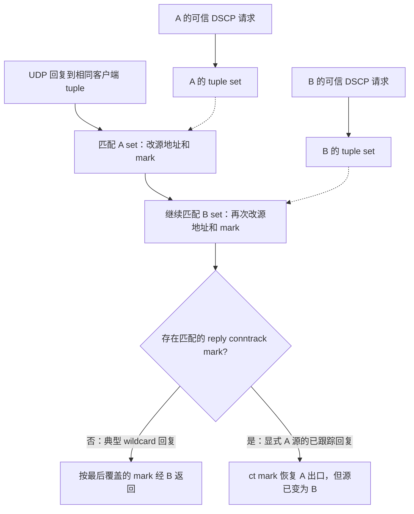

# UDP 回程归属诊断与修复边界

> 地址语义更新：本文基于旧 overlay 正向目标、UDP 二元组学习的诊断/计划为历史记录。
> 已确认改为业务 IP 正向与 DSCP/conntrack 统一回程，见 [修复说明](dnat-service-address-fix.md)。
> 旧 UDP 学习、源地址修正及其有限保护方案不再是运行契约；后续优化必须以新契约为基线。

## 状态

2026-09-16，`patch` 第十五批。新增三项真实 Linux namespace/VXLAN/nft 测试。
UDP 修复方案尚未批准、实现或部署；没有切换线上 HA、修改 rp_filter、增加 xDS 字段
或调整 backend 应用。另已按现有契约修正 HA 切换触发完整 reconcile 的代码，但未部署。
该独立修复不等于解决 UDP 归属，也不能证明上轮四次超时已经消失。

## 已复现行为

测试位于 `edge-lb/src/linux/nft/kernel_tests/ambiguity.rs`，复用 `topology.rs`。
两个 peer namespace 各有一个客户端 socket，客户端 IP/端口完全相同，模拟 backend
看到的跨网关同 tuple；**不是同一个客户端 socket 跨 VIP 切换的端到端测试**。
夹具没有 gateway NAT、HA/GARP、xSync 或云网络，不能替代线上故障归因。

| 场景 | 实际结果 | 结论 |
|---|---|---|
| A 后 B、B 后 A 两种请求顺序 | 同一 8080 服务的两份回复都去 B | 最近请求不是权威归属 |
| 配置中的两个 return path 顺序反转 | 回复仍去 B | 配置先按网关地址等字段排序，交换输入顺序无效 |
| 暂存请求，倒序生成不同 payload 的回复 | 两个 payload 都去 B | 规则不保存响应与请求的逐一对应证据 |
| B 停止请求，A 约 20 秒时续期 | B 学习仍有效时，A 回复继续去 B | 新请求不会移除另一 contract 的旧学习 |
| B 真实 30 秒窗口结束后再等 2 秒 | B set 失效，A 保持有效，回复改走 A | 这是学习窗口边界，不是固定故障时长承诺 |
| B 过期后才生成 B 旧请求的回复 | 该回复也去 A | 超时改变可选路径，不能恢复逐请求身份 |
| 服务显式绑定 A/B overlay 的 8080 | A 回复的源被改成 B overlay，却由 ct mark 经 A VXLAN 发送 | 源地址修正与 conntrack 选路可能互相矛盾 |

每项都核对 payload、实际源地址、两个 peer 的 VXLAN 计数和另一个 socket 没收到数据。
定时测试使用原有 30 秒常量，未缩短生产 timeout。它们是缺陷刻画；修复后必须改成
正确行为断言，不能为维持测试通过而保留错误转发。

## 代码链路

`config/mod.rs::dedup_gateway_return_paths` 按 gateway underlay/overlay 等字段排序。
`linux/nftables.rs::apply_return_path` 按此顺序创建逐路径 UDP OUTPUT 修正规则。
`linux/nftables/udp.rs` 中各动态 set 仅以客户端 IP/端口为 key：



`tools/backend-server/src/server.rs::serve_udp` 使用 `recv_from`/`send_to`，没有保留
每次请求的本地目的地址。对 wildcard socket，仅凭随后生成的 L3/L4 回复和两份学习
记录，无法在延迟/乱序场景还原对应请求的路径。测试 payload 只用来识别测试响应，
不能让 edge-lb 解析 SIP/应用 payload 来选路。

## 不采用的快捷修复

- 改规则顺序或第一次命中即停止：只是换一个固定优先网关，另一方向仍可能错。
- 最后请求获胜：延迟响应和乱序请求下不能保证逐请求归属，违反现有约束。
- 缩短 timeout：可能缩短重叠期，也会更早丢失有效状态，不是正确性修复。
- 只加服务端口：同一个 8080 已复现，而且端口匹配语义本身需要审批。
- BPF miss 就退回旧 nft：旧路径已证明存在歧义，不能把错误隐藏在 fallback 中。
- 下发 active gateway/listener 端口，或关闭 rp_filter：违反边界或与本缺陷无关。

## 有限修复提案（待确认）

建议先修“已有可靠回程证据却被补救规则覆盖”，不承诺一次解决任意 wildcard 双归属。
该范围不改 backend 订阅、gateway flow ABI、客户端 tuple、应用协议或 HA 模型，
不要求改造线上应用。

1. 回复方向 conntrack mark 必须对应当前有效 contract，且原始回复源 IP 与该
   contract 的 backend overlay 一致、能唯一对应，才认可为显式回程证据。
2. 保留该源地址和对应 mark，阻止其他 UDP 客户端 set 再覆盖。不得仅凭源 IP
   看起来是 overlay，就跳过可信请求/连接证据校验。
3. 实现在原生 nft 编码及规则规划层，不引入第二套 BPF 归属表，不在 handler 中
   拼命令；不得用无条件 ACCEPT 绕过其他主机策略。
4. 批准后先冻结 guard 和规则控制流，覆盖有效/无效 mark、重复 overlay、过期或
   撤销 contract、无匹配 conntrack、显式源回复和 wildcard 原有路径。

**仍不覆盖：** wildcard 丢失本地目的地址后的双归属、延迟响应、主动 UDP、任意容器
NAT 后的 tuple。不默认丢弃或强选一路；冲突失败策略以及是否允许应用保留本地地址
上下文，必须另行确认。不能只改 `tools/backend-server` 就宣布所有 SIP 服务透明修复。
本节没有改变已批准的运行契约，实施前需要用户确认有限范围及剩余限制。

## HA 独立修复

原有两条路径违背“切换只改变 VIP 所有权”的既定契约：

- `provider/native/ha.rs` 写入 active 选择后设置业务 `state_dirty`。
- `role/gateway.rs` 发现 VIP 变化后设置 `needs_full=true`。

本批移除这两个仅由 HA 变化产生的触发，手动切换、peer activate、hook/BFD 保留
原有所有权及 VIP 操作。已存在的业务 dirty 不被清除，配置、健康和拓扑变化仍收敛。
回归断言覆盖“HA 不产生业务 dirty”和“HA 不吃掉已有业务 dirty”。

没有新增 readiness RPC、切流时全量同步 maps，或调整启动 snapshot 的独立恢复机制。
修复只移除多余收敛触发，不能声称原来每次 reconcile 都一定 detach，也不能保证
GARP 无损或消除 UDP 双归属。四机仍运行前一轮部署产物。

## 验证

```bash
make test TEST_ARGS='linux::nft::kernel_tests::ambiguity -- --test-threads=1'
make test TEST_ARGS=overlay_bound_udp_reply_can_have_source_overwritten_despite_conntrack_route
make test DOCKER_PRIVILEGED="docker run --rm --privileged -e RUST_TEST_THREADS=1 -v $PWD:/src -v edge-lb-cargo:/usr/local/cargo/registry -w /src edge-lb-build:bookworm"
make check
cargo fmt --all --check
git diff --check
```

全量单线程 **313 项单元测试、1 项 HA 集成测试通过**，check、格式和 diff 检查通过。
第一条聚焦命令在加入显式源测试之前运行了前两项，第二条验证第三项，全量覆盖全部。

线上后续应分开执行“只切流”“只重启备机”，保留有配额目录中的逐请求 TSV、双方 HA
时间戳及回程计数；未经确认不执行可能短暂丢包的线上实验。不提交、推送或合并分支。
