# VXLAN / DSCP 回程验证

本文只描述当前 edge-lb native 数据面，不依赖外部负载均衡器、容器运行时或
第三方 LB API。

## 数据路径

```mermaid
flowchart LR
    client["client"]
    gw_ing["gateway underlay ingress"]
    dnat["native DNAT<br/>select target + write flow"]
    mark["DSCP marker<br/>match listener port"]
    backend["backend app"]
    retmark["backend nftables<br/>DSCP -> ct mark / fwmark"]
    vxret["edge-return<br/>VXLAN VNI 100"]
    vxhub["edge-hub"]
    snat["native reverse NAT / SNAT"]

    client -->|"VIP or gateway IP:port"| gw_ing
    gw_ing --> mark --> dnat --> retmark --> backend
    backend -->|"reply-direction fwmark"| vxret --> vxhub --> snat --> client
```



当前 default 转发模式语义：

- gateway 收到客户端请求后做 DNAT，目标为监听绑定的目标组成员。
- backend 看到真实客户端源 IP。
- gateway 为进入目标端口的流量写 DSCP，backend 根据所有 IPv4 ingress 包上的
  DSCP 在 conntrack original 方向记录 mark，reply 方向恢复 fwmark。
- backend 不接收 listener、target group、service port 或 active gateway 状态。后端
  只接收 VXLAN/DSCP return-path contract。
- backend 回包通过策略路由进入 `edge-return` VXLAN。
- gateway 在 `edge-hub` 收到回包后按 flow state 做反向 NAT，回给客户端。

## 设备命名

| 角色 | 设备 | 说明 |
|---|---|---|
| gateway | `edge-hub` | gateway 侧 VXLAN 接口 |
| backend | `edge-return` | backend 侧 VXLAN 接口 |
| gateway | `underlay_dev` | 对外入口与 VXLAN underlay 设备 |

默认 VXLAN 参数：

| 参数 | 默认值 |
|---|---|
| VNI | `100` |
| UDP port | `4789` |
| MTU | `auto`，常见结果为 `1450` |

## DSCP 与策略路由

每个 gateway 使用自己的 DSCP 值。backend 不需要判断谁是 MASTER，只需要按
各 gateway 下发的 DSCP 分别配置回程规则。

派生规则：

```text
mark  = 0x1000 | ((gateway_slot + 1) << 6) | (dscp & 0x3f)
table = 1000 + (gateway_slot + 1) * 64 + (dscp & 0x3f)
```

这样同一 backend 同时连接两个 gateway 时，不同 gateway 的回程表不会互相覆盖。
路由表中允许存在 gateway underlay 的 host route，用于避免访问 gateway underlay
地址时被 fwmark 默认路由递归送回 VXLAN。

## TCP/UDP 统一回程

业务地址不因关联 backend 而自动替换成 overlay。backend 的回复源必须与正向业务
目标对应，TCP/UDP 统一使用 conntrack 完整连接身份，不学习客户端二元组、不改源 IP。

```nft
chain prerouting {
    type filter hook prerouting priority mangle; policy accept;
    meta nfproto ipv4 ct direction original ip dscp ef counter ct mark set 0x106e
    ct direction reply ct mark 0x106e counter meta mark set 0x106e
}
chain output {
    type route hook output priority mangle; policy accept;
    ct direction reply ct mark 0x106e counter meta mark set 0x106e
}
```

DSCP 只作为受信网络的分类标签，携带同 DSCP 的直连流量也会被分类。
多个 gateway 必须使用不同 DSCP（1..63）、mark 和路由表，冲突会在应用前拒绝。
源地址选择、多 gateway 相同五元组与升级排空要求见
[DNAT 业务地址修复](dnat-service-address-fix.md)。

## 验证命令

管理 API：

```bash
curl -H "Authorization: Bearer <token>" \
  http://<gateway-underlay>:18080/api/v1/status
```

监听和目标组：

```bash
curl -H "Authorization: Bearer <token>" \
  http://<gateway-underlay>:18080/api/v1/listener-configs

curl -H "Authorization: Bearer <token>" \
  http://<gateway-underlay>:18080/api/v1/target-groups
```

gateway 入方向抓包：

```bash
tcpdump -ni <underlay_dev> -nn 'tcp port <port> or udp port <port>'
```

backend 回程状态：

```bash
ip -d link show edge-return
ip rule show
ip route show table <derived-table>
sudo nft -a list table inet edge_lb_return
```

业务连通性：

```bash
printf 'discover\n' | nc -N -w 1 <vip-or-gateway-ip> <port>
printf 'discover\n' | nc -u -w 3 <vip-or-gateway-ip> <port>
```

UDP 验证时，backend nft table 里应看到：

- `prerouting` 的 `ct direction original ip dscp <value>` counter 增加。
- 回复对应的 `ct direction reply ct mark <mark>` counter 增加。
- 回包内层源为业务 IP，经过 gateway reverse NAT 后客户端看到 VIP。
- 不应出现 `udp_reply_<mark>` 动态 set 或 `ip saddr set <overlay>`。
- 不应出现按业务服务端口匹配的 backend 回程规则。

## 预期结果

- 监听列表中一个监听可以包含多个对外 IP，例如本机 underlay IP 和 HA VIP。
- TCP+UDP 监听在 UI 和 API 中保持为一个 listener，协议显示为 `tcp+udp`。
- 目标组健康状态只统计「健康」「不健康」「未关联监听」。
- DSCP 统计只保留 `matched` 和 `changed`，不再统计经过网卡的全部包数。
- backend 的 `edge-return` 上同时存在来自两个 gateway 的 overlay 地址时，
  每个 DSCP 对应自己的策略路由表。

## 常见问题

### backend 收到流量但客户端无响应

优先检查 gateway 的 reverse NAT flow state 是否命中，以及 backend 是否通过
`edge-return` 回包。若回包从 backend 物理网卡直接出公网，通常是 DSCP/nftables
mark 或策略路由未生效。

### VXLAN 设备存在但无法回包

检查 `edge-return` 是否已包含当前 gateway overlay 对应的本机地址，且 FDB peer
指向对应 gateway underlay IP。backend 每次 xDS 重连成功后会重新收敛 VXLAN；
gateway 侧巡检间隔默认较低频，避免频繁重建数据面。

### route table 提示 non edge-lb route

edge-lb 管理的 route table 允许包含当前 gateway underlay host route 和 default
via gateway overlay route。其他路由应作为冲突上报，避免误接管外部组件创建的
策略路由。
